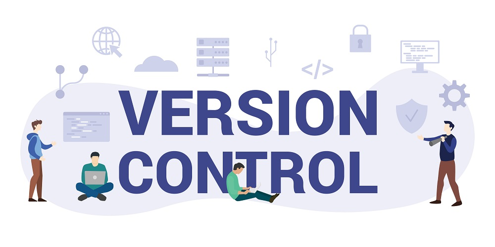
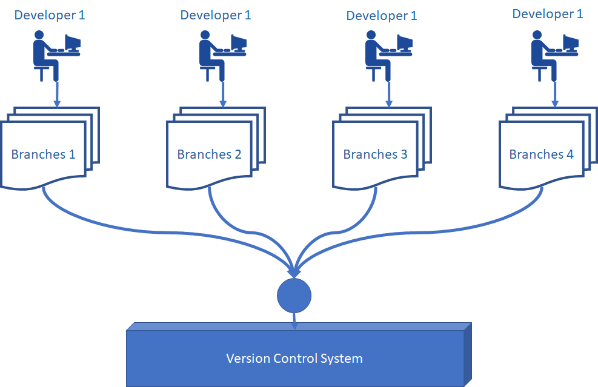
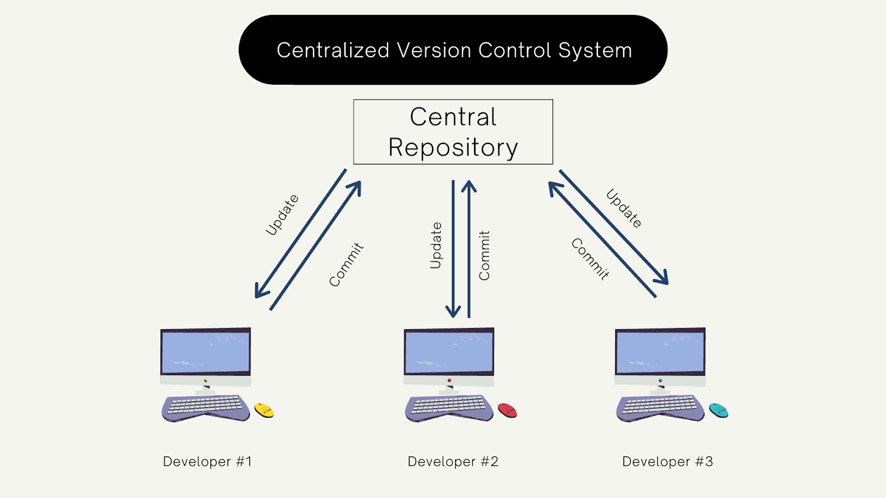
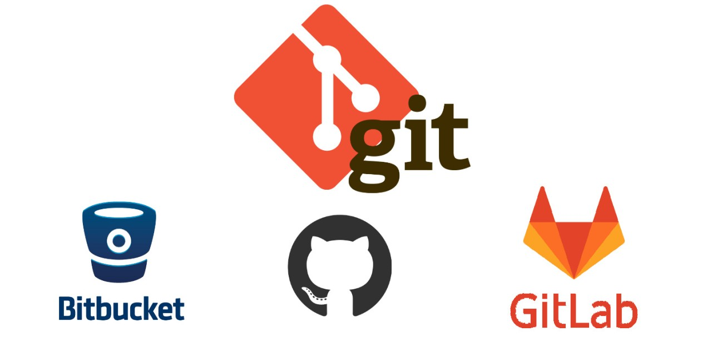

# Version Control System

Hệ thống quản lý phiên bản (VCS) có tác dụng lưu trữ lại tất cả các phiên bản và quản lý mọi sự thay đổi về mã nguồn của một hệ thống ứng dụng phần mềm. Có tác dụng như dòng thời gian (timeline) giúp quản lý các sự thay đổi, tích hợp các thay đổi, tính năng mới vào hệ thống và kiểm soát rủi ro tốt hơn.

Hỗ trợ development team hiệu quả. VCS tổng hợp và tracking các thay đổi đến source code của hệ thống từ các member các khác nhau trong một development team.

## Các thành phần của một VCS

Một hệ thống VCS hoàn chỉnh bao gồm:

- **Remote Repository**: Server của các VCS provider như github, gitlab, bitbucket,... có nhiệm vụ lưu trữ và quản lý source code của dự án.

- **Local Repository**: Bản chất nó là bản copy source code của remote repository. Các thành viên trong development team dự án sẽ clone source code từ remote repository về máy cá nhân.

- **Commit**: Một snapshot chứa các thay đổi source code (fix bug, implement feature, refactoring,...). Mỗi một commit như một phiên bản mới của mã nguồn.

- **Pull Request / Merge Request**: Các commit khi được push lên sẽ cần phải tạo MR hay PR để được review code và hợp nhất vào version chính thức của source.

- **Branching**: Source code sẽ được phân nhánh để thuận tiện cho việc triển khai các feature riêng biệt đồng thời của developer mà không sợ bị đụng độ chồng chéo code của nhau.

## Một số VCS phổ biến

- Github (https://github.com)

- Gitlab (https://about.gitlab.com)

- Bitbucket (https://bitbucket.org)
