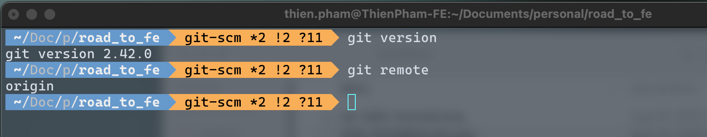

# Git

https://git-scm.com

## So sánh Git và VCS

Git và các hệ thống VCS như (github, gitlab, bitbucket,...) **không giống nhau**.

- **VCS**: Kho lưu trữ mã nguồn phi tập trung. Developer ở bất cứ đâu cũng đều có thể tương tác với source code được lưu trữ trên VCS.

- **git**: Một thư viện hay một phần mềm chạy trong máy local của dev. Hỗ trợ các command sử dụng qua CLI để tương tác với VSC và quản lý local repository.

  

## Git usage

### Sử dụng git qua CLI (Command Line Interface)

### Sử dụng git qua GUI tool (Graphic User Interface)

Hiện nay có một số tool GUI giúp làm việc với git

#### Git Fork (https://git-fork.com)

#### Source Tree (https://www.sourcetreeapp.com)

#### Git graph [(VSCode Extension) ](https://marketplace.visualstudio.com/items?itemName=mhutchie.git-graph)

Tham khảo: https://blog.devart.com/best-git-gui-clients-for-windows.html

## Phân vùng làm việc của git

- **Working directory**: Nơi sẽ xảy ra các thay đổi về source code. Sự thay đổi trên các file này cũng chia ra các trạng thái

  - Untracked: File được tạo mới hoàn toàn hay các resource được thêm vào và chưa được track.

  - Tracked: Khi file đã được add và đã từng commit thì nó đã được track và nếu có thay đổi nó sẽ có 3 trạng thái
    - modifed
    - staged
    - deleted

- **Staging area**: Nơi chuẩn bị cho quá trình commit vào local repository và push lên remote repository. Mọi sự thay đổi đối với source code khi nằm trong area này đều đã được tracking, nếu không nó sẽ không được xem xét và commit vào local repository.

- **Local repository**: Source code trên máy của developer. Mọi sự thay đổi sẽ được commit vào đây và push lên remote repository. Local repository cần được cập nhật liên tục với remote repository để bảo đảm source code luôn được đồng bộ và thống nhất

- **Remote repository**: Kho lưu trữ của VCS provider. Code được lưu ở đây đa phần là code đã được review và đưa vào hoạt động (production).

## Git cheatsheet

- http://git-cheatsheet.com

- https://dev.to/ruppysuppy/git-cheat-sheet-with-40-commands-concepts-1m26

- https://www.interviewbit.com/git-cheat-sheet/

- https://www.youtube.com/watch?v=RxHJdapz2p0