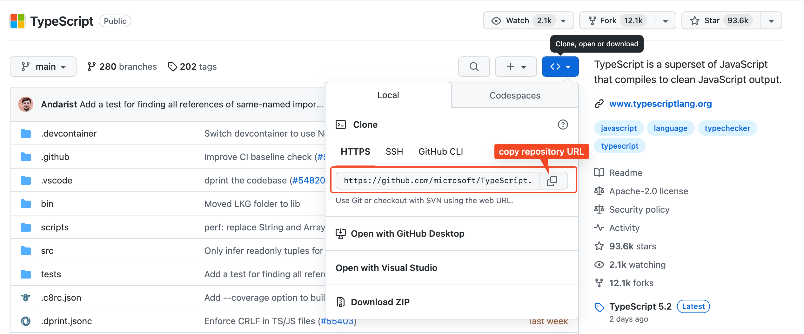

# Clone repository


Clone là việc copy và một repository được lưu trữ ở VCS về máy của mình. Trong một dự án thì các developer trong team sẽ clone code về máy và bắt đầu phát triển các tính năng của riêng từng người.

## Clone repository có sẵn

Để clone repository một repository có sẵn trên VCS về máy của mình:

- Cần lấy url của repository muốn clone.

  

- Tại máy local của mình mở terminal tại thư mục mình muốn clone và gõ lệnh:

  ```bash
  git clone <repository_url>
  ```

  
