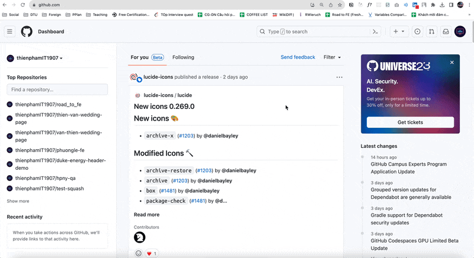
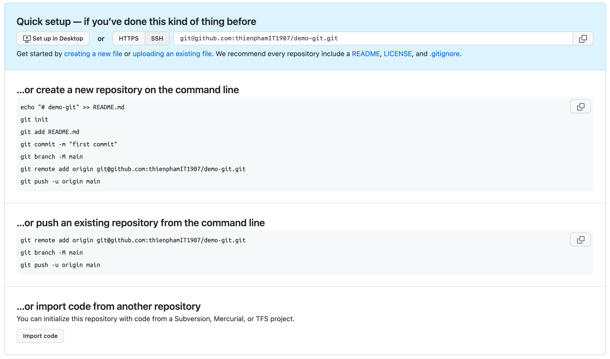

# Create repository

## Tạo mới một repository từ đầu

- Tạo một repository trên VSC (github)

  

- Sau khi tạo xong github sẽ hiển thị hướng dẫn cách đồng bộ remote repository về local repository.

  

- Tại thư mục chứa dự án, mở terminal và sử dụng lệnh bên dưới để tạo ra một file `.git` dùng để track changes cho repository.

  ```bash
  git init
  ```

- Tham chiếu local repository đến remote repository:

  ```bash
  git remote add origin <repo_url>
  ```
