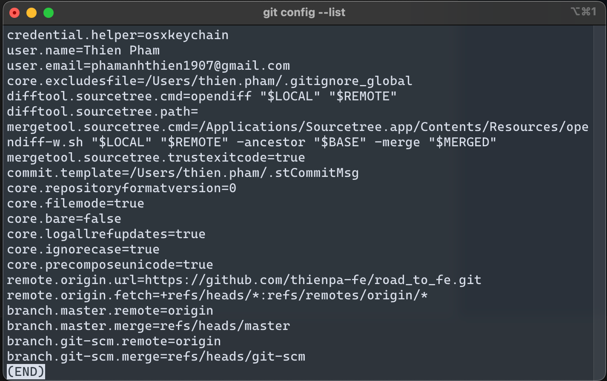
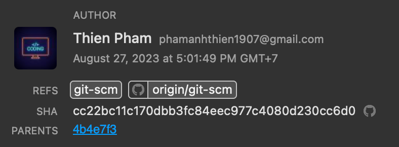

# Git Config

Mỗi local repository đều chứa các config cũng như thông tin của author mỗi khi có một commit.

- Để xem được toàn bộ config của local repository hiện tại:

  ```bash
  git config --list
  ```

  

- Config thông tin author để làm việc cùng với các member khác trong dự án:

  ```bash
  cd my_project # change directory to current project

  git config user.name="Thien Pham"

  git config user.email="phamanhthien1907@gmail.com"
  ```

  
