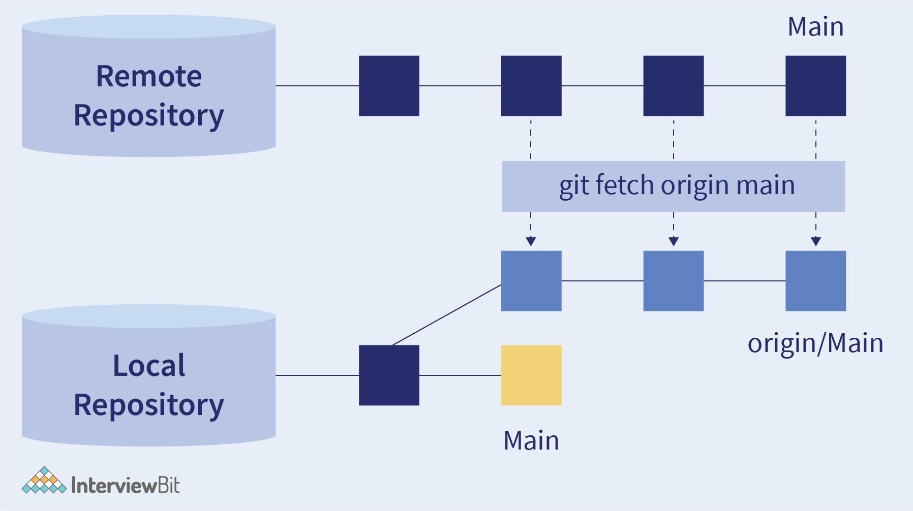

# Fetch - Pull - Commit - Push

## Fetch



- Cập nhật các thay đổi cũng như fetch các nhánh mới, các commit mới từ remote repository về local repository.

  ```bash
  git fetch
  ```

## Pull

- Kéo các commit của nhánh hiện tại từ remote repository về local repository:

  ```bash
  git pull
  ```

## Commit

- Lệnh này giúp đóng gói các thay đổi thành một commit và có commit message để mô tả những thay đổi đó có tác dụng gì, triển khai cho tính năng nào.

  ```bash
  git commit -m "commit message"
  ```

## Push

- Push commit tại local branch từ local repository lên remote branch tương ứng ở remote repository

  ```bash
  git push
  ```

  Trong trường hợp branch mới tạo ở local repository. Nếu push bình thường thì sẽ báo lỗi, vì branch chưa được tạo ở remote repository nên khi commit dùng lệnh sau để vừa push commit vừa tạo luôn branch mới trên remote repository:

  ```bash
  git push -u origin <current_branch>
  ```
