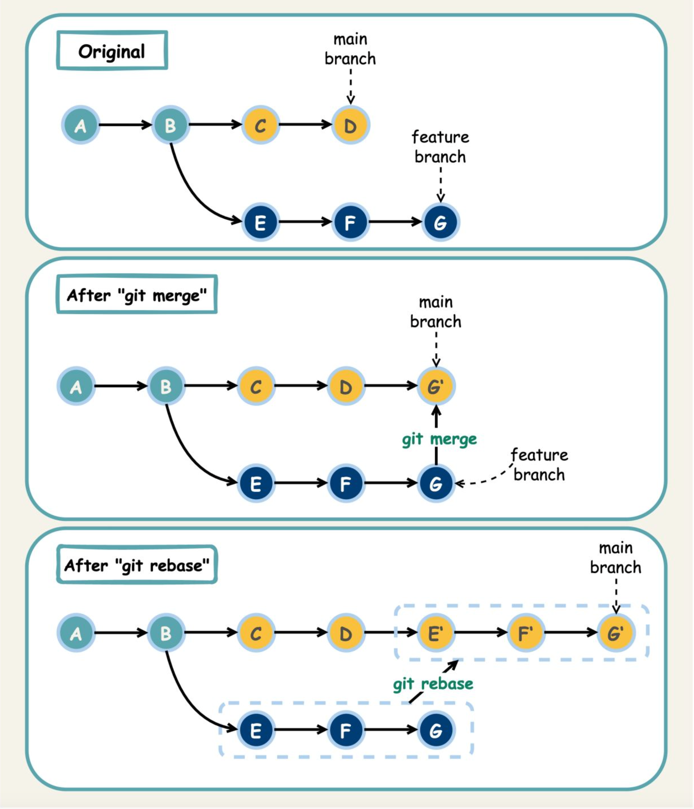

# Merge & Rebase

## Merge

- Quá trình merge cần sự tham gia của 2 loại branch:

  - **Target branch**: Branch đích để merge (thường là main, master, develop,...)

  - **Merge branch**: Branch cần merge vào branch đích (thường là hotfix, feature, fix bug...)

- Để merge code ta cần checkout target branch. Sau đó sử dụng lệnh:

  ```bash
  git checkout <target_branch>

  git merge <merge_branch>
  ```

### Merge fast-forward

Xảy ra trong trường hợp có branch merge checkout từ branch target và tại thời điểm merge target branch chưa có bất cứ commit mới nào.


### Merge non fast-forward

Xảy ra trong trường hợp có branch merge checkout từ branch target và tại thời điểm merge target branch đã có update mới và việc merge này sẽ tạo ra một merge commit mới chứa tất cả thay đổi của target branch và merge branch.


## Rebase


- Quá trình rebase cần sự tham gia của 2 loại branch:

  - **Target branch**: Branch đích để merge (thường là main, master, develop,...)

  - **Rebase branch**: Branch cần merge vào branch đích (thường là hotfix, feature, fix bug...)

- Để rebase code ta cần checkout rebase branch. Sau đó sử dụng lệnh:

  ```bash
  git checkout <rebase_branch>

  git rebase <target_branch>
  ```

  

- Lưu ý: Không bao giờ rebase tại target branch. Vd Khi rebase master vào feature thì nó sẽ di chuyển tất cả commit của master lên đầu nhánh feature

> Muốn kết hợp nhánh feature vào master:
>
> - **merge**: Checkout qua master và git merge feature.
> - **rebase**: Checkout feature và git rebase master.

## So sánh giữa merge và rebase




## Link tham khảo

- https://www.atlassian.com/git/tutorials/rewriting-history/git-rebase

- https://www.atlassian.com/git/tutorials/using-branches/git-merge

- https://www.atlassian.com/git/tutorials/merging-vs-rebasing
