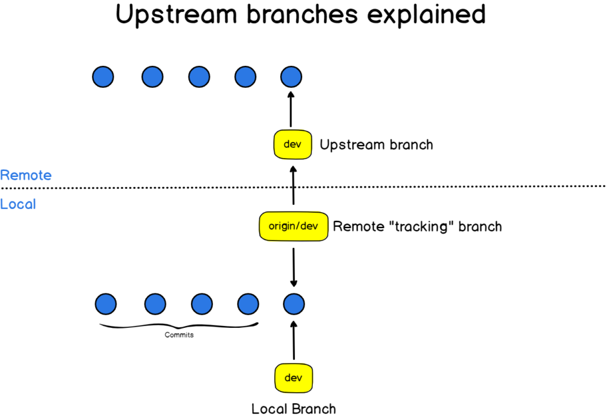

# Branching


Branching là kĩ thuật phân nhánh khi làm việc với git. Dùng để quản lý các phiên bản hiện tại của dự án đang hoạt động cũng như phát triển các phiên bản mới song song đồng thời. Dựa trên việc tách phiên bản hiện tại ra thành các bản copy và thực hiện các thay đổi trên bản copy rồi sau đó hợp nhất nó.

## Các loại branch

- Một repository luôn luôn có một **main branch** là `master` hoặc `main` hoặc `release` tuỳ theo cấu hình dự án. Đây là nhánh chứa phiên bản hoàn thiện nhất sau mỗi giai đoạn phát triển của dự án và dùng để build production cho người dùng. Các tính năng mới cho dự án vẫn đang được phát triển song song và sẽ được hợp nhất code vào nhánh chính này và cập nhật phiên bản mới cho production.

  

- Mỗi một branch được tạo ra sẽ có **local branch** và **remote branch**.

  - **Local branch**: Branch được tạo ở local repository.

  - **Remote branch**: Branch được tạo ở remote repository.

  

  > luôn luôn phải giữ code trên local branch và remote branch đồng bộ với nhau để tránh mất code và xử lí các conflict không cần thiết.

## Git command

- Kiểm tra branch hiện tại trong repository

  ```bash
  git branch # All local branches

  git branch -a # All local branches and remote branches

  ```

- Tạo và checkout một branch

  ```bash
  # Chỉ tạo branch thành công khi nhánh hiện tại có ít nhất 1 commit
  git branch <branch_name>
  git checkout <branch_name>
  ```

  ```bash
  git checkout -b <branch_name> # Create branch then checkout.
  ```

- Đổi tên branch

  ```bash
  git branch -m <old_branch_name> <new_branch_name>
  ```

- Xoá branch

  ```bash
  git branch -d <branch_name> # Delete local branch

  git branch -D <branch_name> # Delete local branch and remote branch also
  ```

## Playground

https://learngitbranching.js.org/?locale=en
