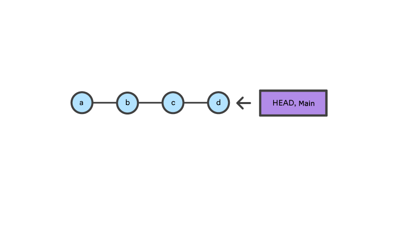
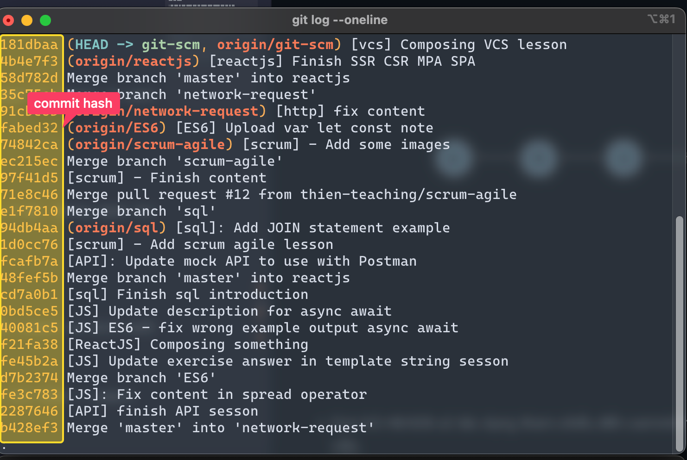
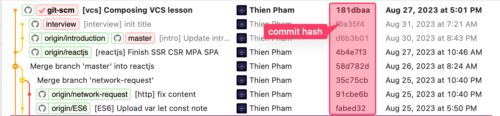

# HEAD - reset - revert

## HEAD pointer



- Con trỏ HEADS có tác dụng tham chiếu đến commit hiện tại → Cũng có nghĩa HEAD là commit mà mình đang làm việc.

- Hay dùng để dịch chuyển giữa các commit trong history tree của dự án.

- Bình thường thì HEAD đi ngầm theo nhánh. Nhánh trỏ đến commit nào thì HEAD ở đó. Nhưng HEAD thì có thể tháo ra được để trỏ đến các commit khác.

## Detach HEAD

Là việc tách rời commit hiện lại mà con trỏ HEAD đang tham chiếu để trỏ đến commit mà mình muốn checkout. Mặc định: HEAD → branch → commit. Khi dùng lệnh checkout một commit nào đó thì HEAD → commit (tách rời khỏi branch)

Có 2 cách để dịch chuyển con trỏ HEAD giữa các commit:

- **Commit hash**:

  

  

  Để biết được mã băm thì phải sử dụng lệnh `git log`. Trong đó không cần phải gõ lại y nguyên mã băm (vì nó rất dài là loằng ngoằng). Chỉ cần gõ 1 vài kí tự đầu của nó rồi tab ra.

- **Relative reference**:

  Ngoài cách xác định commit bằng mã hash thì còn cách dịch chuyển bằng cách track số lượng commit mà mình đã thực hiện

  - `HEAD^`: Dùng để lùi lại **một** commit ngay trước commit hiện tại.

    ```bash
    git checkout HEAD^ # Back to 1 commit previous

    git checkout HEAD^1 # Back to 1 commit previous
    ```

  - `HEAD~`: Có chức năng giống với `HEAD^`. Dùng trong trường hợp muốn dịch chuyển lùi lại một số lượng commit cụ thể. Nếu không định nghĩa cụ thể số lượng commit cần lùi thì mặc địnhcứ mỗi lần thực thi con trỏ HEAD sẽ thụt lùi lại 1 commit

    ```bash
    git checkout HEAD~ # Back to 1 commit previous
    ```

    ```bash
    git checkout HEAD~3 # Back to 3 commits previous
    ```

## Reset

Đưa HEAD pointer và local branch hiện tại về commit chỉ định. Có 3 options thông dụng (soft, mixed, hard).

- `git reset <commit_hash> / git reset <commit_hash> --mixed`: reset lại những thay đổi tại working directory (bao gồm những thay đổi của commit đang reset và những thay đổi đang thực hiện nếu có) để có thể review lại và add vào staged area nếu cần.
  
- `git reset <commit_hash> --soft`: Reset lại các thay đổi ở staged area tương ứng với commit đang reset. Đồng thời giữ lại các thay đổi hiện thời ở working directory nếu có.

- `git reset <commit_hash> --hard`: Unchange toàn bộ thay đổi của staged area và và giữ cho source code của current branch đồng nhất với commit mà nó đang reset.

> Hạn chế reset lại history của một branch vì trong trường hợp branch đang được người khác checkout để code thêm vào mà mình reset thì sẽ bị mất code dẫn đến việc conflict và ảnh hưởng đến flow làm việc của team.

## Revert

Tạo ra một commit mới đảo ngược lại commit cũ, có nghĩa là loại bỏ đi hết những thay đổi của commit trước, những gì add vào thì sẽ được remove ra và ngược lại.

> Revert tạo ra commit mới chứ không xoá đi commit cũ để giữ nguyên vẹn history hỗ trợ việc trace issue sau này nếu phát sinh sự cố.

```
git revert <commit_hash>
```


## Tham khảo

https://www.w3schools.com/git