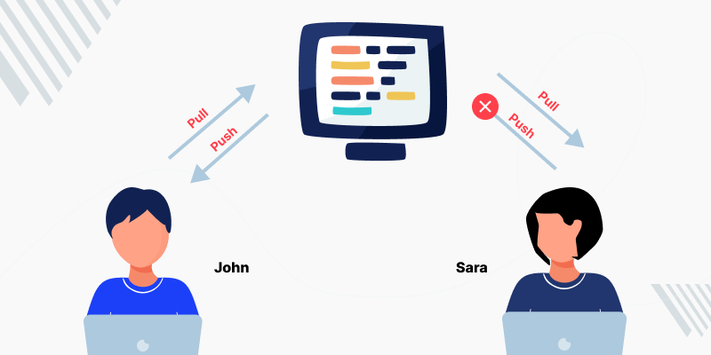
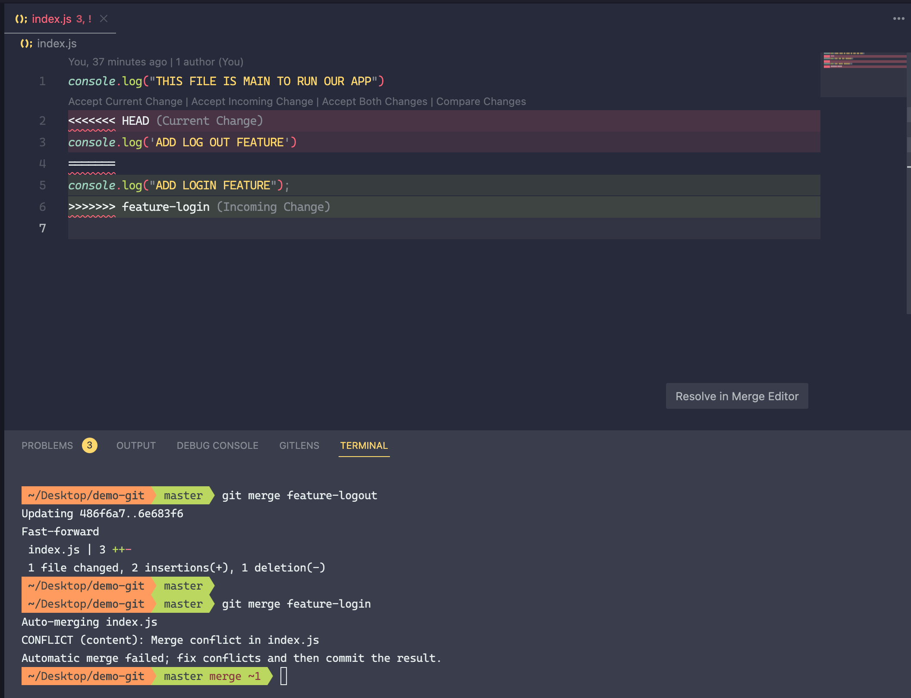
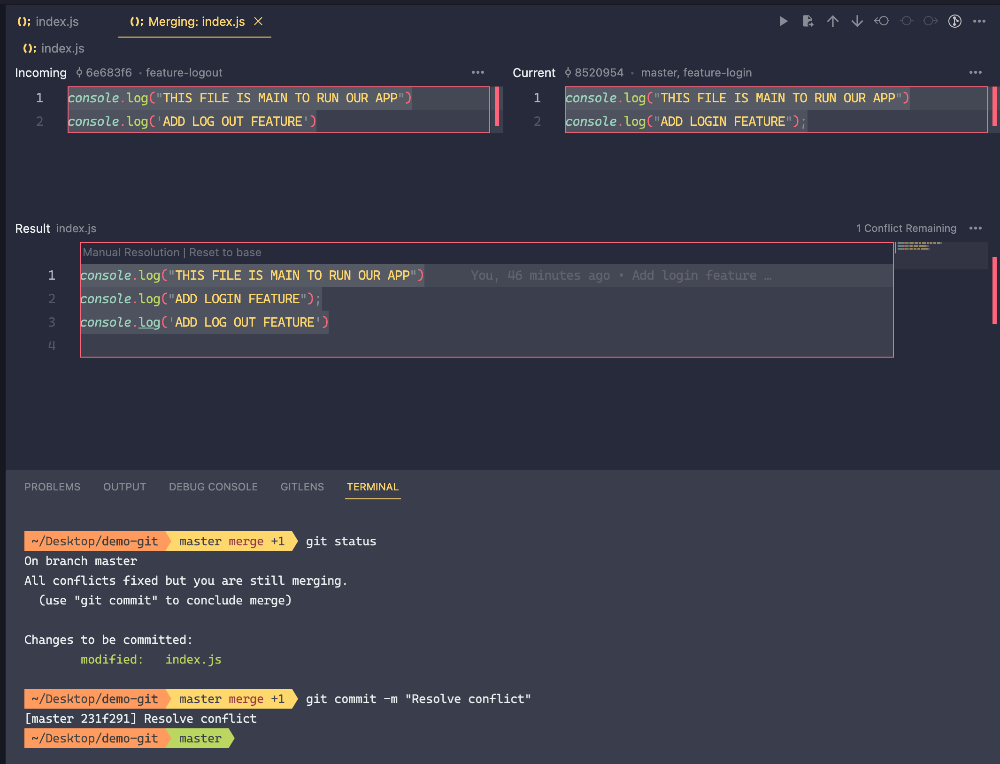

# Conflict

Conflict code là một sự cố xảy ra khi git không thể merge code của hai commit khác nhau. Lí do cho sự cố này là khi các developer cùng sửa chung một file, chung một số dòng code hoặc các commit của branch khác nhau cùng change trên một số dòng hay một block code nào đó.

## Tái hiện conflict

- Tại branch master của repository checkout ra 2 branch _feature-login_ và _feature-logout_.

- Thực hiện update code trên cùng một file, sau đó commit.

- Giả sử branch master sau khi merge xong nhánh _feature-login_ và merge tiếp nhánh _feature-logout_ thì conflict sẽ xảy ra.

- Current change: Nhánh target hiện tại, chứa code mình đang có.

- Incoming change: Chứa những gì mình sẽ merge.

- Accept incoming change: Sẽ bỏ qua những gì đang có hiện tại và thay bằng code của nhánh khác.

- Accept current change: Bỏ qua những gì sắp đc merge và giữ lại code hiện tại.

## Resolve conflict

Để giải quyết conflict cần discuss với các bên liên quan cụ thể là những member đã thực hiện change ở vị trí này để thống nhất change cuối cùng và sau đó commit lại một lần nữa để resolve conflict.

## Ngăn chặn conflict

Trong quá trình phát triển phần mềm, các thành viên dự án làm việc và push code lên với số lượng lớn nên sẽ không thể tránh khỏi việc xảy ra conflict code nhưng ta vẫn có thể hạn chế được

### Fetch và pull code thường xuyên

Trước khi bắt đầu làm việc thì luôn luôn fetch và pull code mới nhất của các branch mình checkout. Để kịp thời cập nhật những thay đổi mới trên branch và tiếp tục làm việc chứ không làm việc trên nhưng commit cũ.

### Luôn luôn phân nhánh khi làm việc

Mỗi thành viên trong team khi nhận task thì nên phân nhánh ra để làm việc. Sau đó sẽ merge lại chứ không nên cùng làm việc chung trên một nhánh dẫn đến việc commit thay đổi chồng chéo lên nhau và conflict.

### Tăng cường giao tiếp

Luôn luôn giao tiếp với các thành viên trong team để nắm được tình hình công việc của các thành viên thông qua đó có thể dễ dàng đoán trước và xử lí được một số tình huống phát sinh gây ra conflict code.

### Review code

Code nên được review kĩ càng thông qua các pull request / merge requesst cũng sẽ giúp tránh được tình trạng conflict

### Define git flow

Cần có một quy trình thống nhất từ lúc nhận task đến lúc hoàn thành, push lên repository và được merge vào các main branch để tất cả mọi người có thể follow theo.

## Tham khảo

- https://aptechbmt.edu.vn/hoc-lap-trinh/git-github/bai-7-git-conflicts-cach-xu-ly-conflict-trong-khi-merge-18.html

- https://vulehuan.com/vi/blog/2023/03/hieu-git-conflict-nguyen-nhan-hau-qua-va-cach-giai-quyet-64680f9764ac40ae37cdf495.html#gsc.tab=0

- https://www.atlassian.com/git/tutorials/using-branches/merge-conflicts
