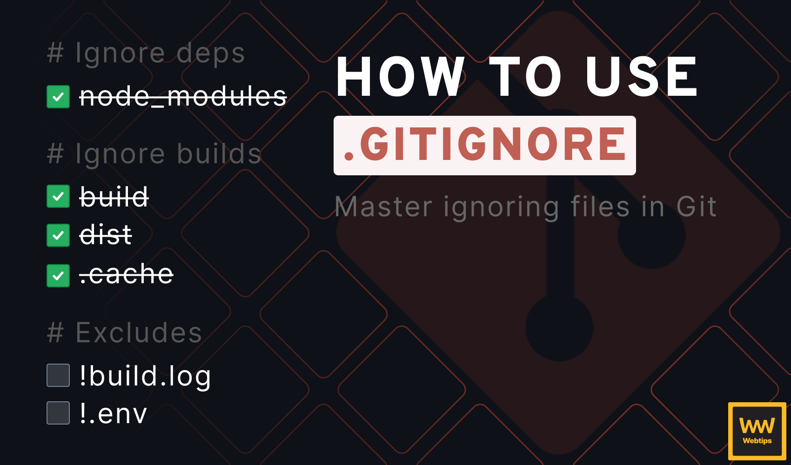
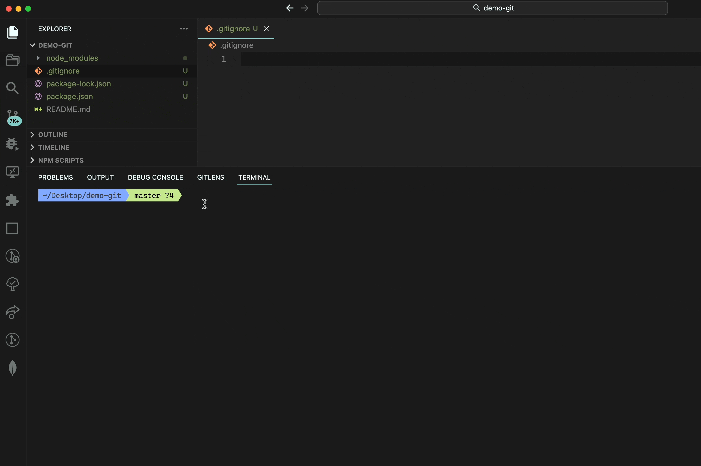

# Git Ignore



Khi làm việc trong dự án cần có hệ thống VCS để lưu trữ source code và hợp nhất thay đổi của các thành viên trong team dev. Ngoài việc đẩy source code lên thì có một số loại file không nên lưu trữ trên repository mà chỉ nên lưu giữ ở máy local của developer

## Các loại file không cần thiết lưu trữ trên VCS

- node_modules

- Các file config của IDE tự sinh ra trong quá trình code và build project trên local

## .gitignore

Để triển khai tính năng ignore của git. Ngăn chặn không cho đẩy các file không cần thiết lên remote repository thì ta cần tạo file `.gitignore` và list chúng ra trước khi add change vào staged.

Git sẽ không track những file được liệt kê trong `.gitignore`. Bản thân nó thì vẫn bị track như bình thường nếu có sự thay đổi.

```
node_modules/

*.tsx

*.js

package.json
```



## Tham khảo

- https://www.w3schools.com/git/git_ignore.asp?remote=github
