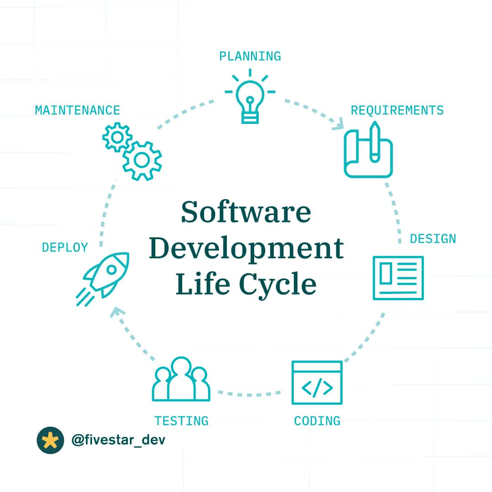
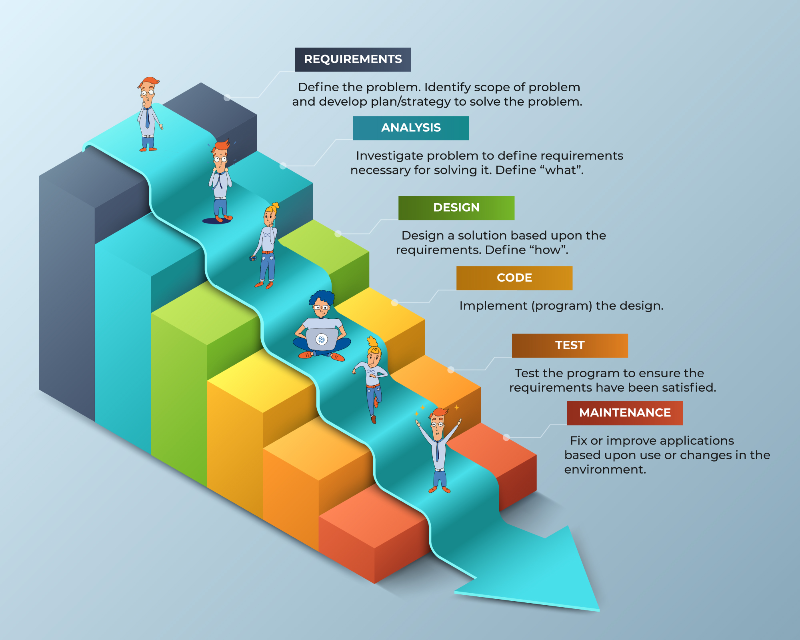
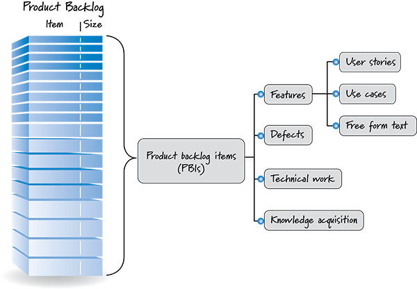
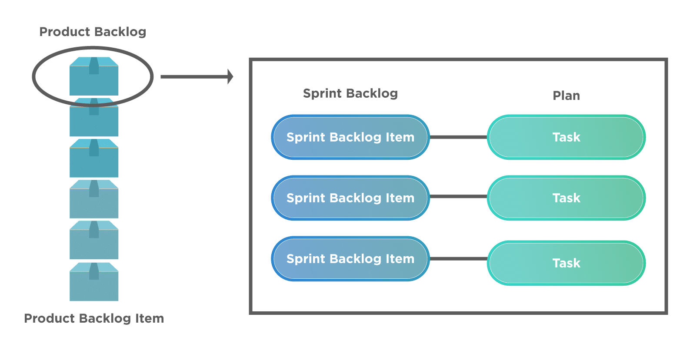
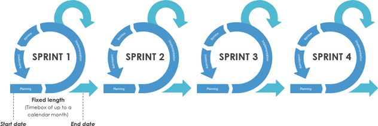
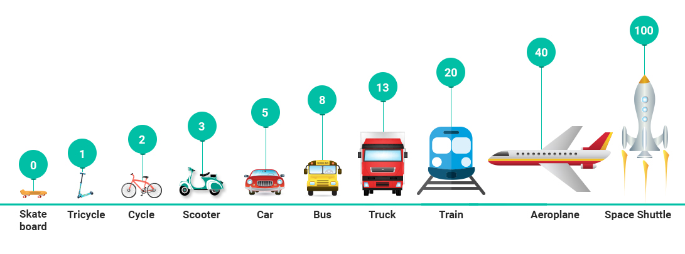
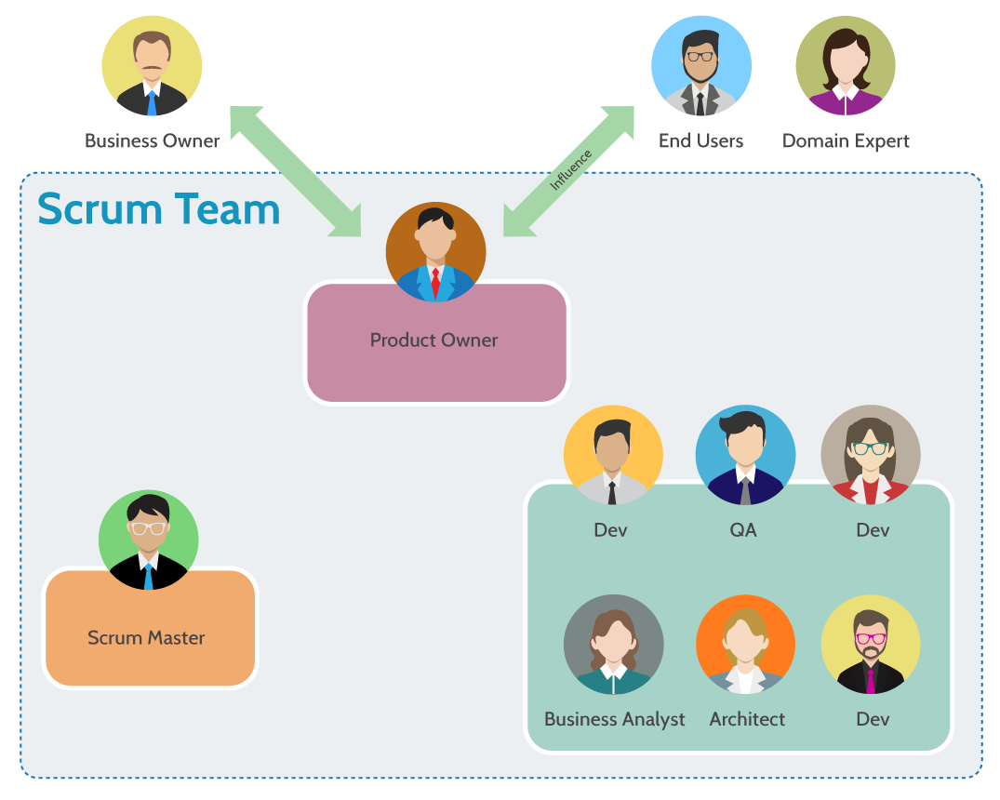
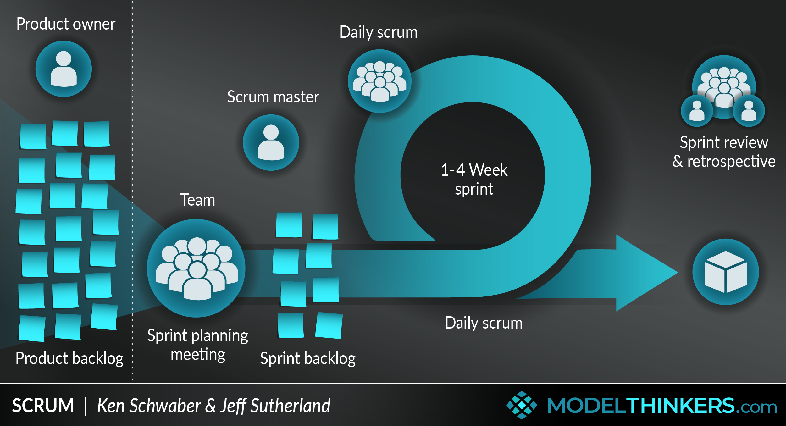

# Agile - Scrum

## SDLC

Quy trình phát triển phần mềm bao gồm 6 giai đoạn

### **1. Planning**

Lên ý tưởng về dự án / Thu thập yêu cầu từ khách hàng.

### **2. Requirement**

Phân tích yêu cầu thành các tài liệu đặc tả. Các sơ đồ chức năng của hệ thống.

### **3. Design**

Dựa vào tài liệu đặc tả, team Designer sẽ để triển khai các chức năng thành các màn hình sao cho đem lại trải nghiệm UX/UI tốt nhất.

### **4. Coding**

Dev sẽ bắt đầu nhận task và triển khai các tính năng đã được thiết kế bằng code và đảm bảo nó theo đúng yêu cầu.

### **5. Testing**

Task của dev sau khi được triển khai sẽ trải qua quá trình kiểm thử. QA sẽ định nghĩa các cases có thể xảy ra cho phần chức năng đã triển khai dựa trên yêu cầu có sẵn

- PASS: Task đã sẵn sàng cho giai đoạn tiếp theo.

- FAILED: Task sẽ được trả lại cho dev để thực hiện các cập nhật và sẽ được test lại một lần nữa cho đến khi PASS. Một số lí do làm task fail khi test:

  - Tính năng hoạt động không đúng yêu cầu về mặt UI và logic.

  - Không pass hết được bộ test cases.

  - Task gây ảnh hưởng đến sự ổn định của hệ thống và các chức năng khác.

### **6. Deploy**

- Task ở giai đoạn này đã hoàn thiện và được kiểm tra đầy đủ, sẵn sàng triển khai lên môi trường thử nghiệm (testing) để khách hàng có thể dùng thử

- Sau khi tính năng hoạt động ổn định trên môi trường thử nghiệm thì sẽ được triển khai tiếp lên môi trường chính dành cho người dùng cuối (production).

### **7. Maintenance**

- Tính năng sau khi triển khai lên môi trường production sẽ được theo dõi về độ ổn định cũng như các vấn đề về performance.

- Tuỳ vào cam kết giữa team dự án và khách hàng mà sẽ thực hiện các enhance, nâng cấp cũng như fix lỗi phát sinh trong quá trình hệ thống hoạt động.

## Mô hình phát triển phần mềm

Dựa vào các giai đoạn của vòng đời phát triển phần mềm. Các mô hình phát triển từ đó cũng sẽ được triển khai.

### Waterfall

Một trong những mô hình phát triển phần mềm đời đầu và được sử dụng rộng rãi trong ngành công nghiệp phần mềm.

Ở giai đoạn này các bước phát triển sẽ được sắp xếp nối tiếp nhau và tuần tự diễn ra. Giai đoạn này hoàn thành rồi mới được chuyển sang giai đoạn tiếp theo và không bao giờ xảy ra sự mâu thuẫn giữa các bước trong mô hình.

Các giai đoạn chuyển từ mức cao hơn xuống mức thấp hơn. Giống như một thác nước nên có tên là waterfall.

- Ưu điểm:

  - Luồng làm việc đơn giản, dễ hiểu, dễ áp dụng nên mô hình này thường áp dụng cho các dự án nhỏ có logic đơn giản và yêu cầu ít thay đổi.

  - Các tiêu chí đầu vào và đầu ra được xác định dễ dàng, nhờ đó dễ đánh giá được chất lượng.

- Nhược điểm:

  - Phải đợi đến khi sản phẩm hoàn thành khách hàng mới được tiếp cận, ví dụ quy trình waterfall phát triển sản phẩm nếu mất 6 tháng tới 1 năm lúc release sản phẩm không có gì đảm bảo rằng yêu cầu của user không đổi ⇒ Còn lại trong thời gian đó thì khách hàng hoàn toàn không biết gì về ứng dụng đang được phát triển.

  - Không thích hợp với các dự án lớn phức tạp lâu dài, có yêu cầu thay đổi thường xuyên và tính năng được define liên tục.

  - Vì diễn ra tuần tự nên cần phải planning chính xác các bước thật chính xác. Trong mô hình dù có bất cứ sai sót hay thay đổi nào phát sinh cũng sẽ quay lại bước đầu tiên và cứ như thế ⇒ Tốn kém thời gian, chi phí và nhân lực.

  - Chỉ có thể next giai đoạn chứ không thể back giai đoạn được vì k thể đánh giá được rủi ro và cách thức thực hiện lại bước trước đó ⇒ Không thể chuẩn bị được giải pháp tốt nhất

### Agile

Là một bộ triết lí bao gồm các nguyên tắc phát triển phần mềm có thể linh hoạt biến đổi dựa theo nhiều yếu tố khác nhau. Agile ra đời khi có đến 70% các dự án phần mềm bị thất bại và sự bất cập của mô hình waterfall cùng các mô hình phát triển khác.

Tuyên ngôn Agile: https://agilemanifesto.org/

- Cá nhân và sự tương tác hơn là quy trình và công cụ (giao tiếp với nhau tốt hơn)

- Phần mềm chạy tốt hơn là tài liệu đầy đủ. (KH cần 1 sản phẩm có thể chạy đc để trải nghiệm hơn là 1 xấp tài liệu ngồi đọc)

- Cộng tác với khách hàng hơn là đàm phán hợp đồng.

- Phản hồi với các thay đổi hơn là bám sát kế hoạch.

  **=> Chúng tôi đánh giá cao các mục ở bên trái hơn, mặc dù các điều bên phải vẫn còn giá trị.**

---

Agile được thể hiện qua 3 tiêu chí:

#### 1. Transparency (Tính minh bạch)

Các loại minh bạch:

- Minh bạch về định nghĩa hoàn thành: Để team hiểu giống nhau và làm ra sản phẩm chất lượng như nhau.

- Minh bạch về tầm nhìn và sản phẩm: PO phải luôn chia sẻ để định hướng cho team.

- Minh bạch trong từng task mình làm, độ ưu tiên, mức độ đáp ứng users story.

- Minh bạch về estimate.

- Còn nhiều loại minh bạch khác nữa, nếu đi vào chi tiết thì cũng rất nhiều.

#### 2. Inspection (Tính kiểm tra)

Các thành viên trong team tự kiểm tra lẫn nhau thông qua các buổi meeting, daily standup để đồng bộ thông tin và tình trạng của nhau sau mỗi ngày làm việc, xem có cần support không, có vấn đề gì không. Phát hiện các vấn đề từ sớm để bám sát tiến độ dự án.

#### 3. Adaption (Tính thích nghi)

Thích nghi cải tiến liên tục sau mỗi vòng lặp quy trình phát triển (spỉnt) để giải quyết các vấn đề về dự án, nhân sự, công nghệ, khách hàng...

> 3 yếu tố này nếu đứng riêng lẻ sẽ không có tác dụng gì nhiều trong dự án, vì thế scrum áp dụng cả 3 cái này thành 1 quy trình thống nhất, thế nó mới là trụ cột ⇒ Scrum không chỉ dùng đc trong ngành phần mềm mà còn các ngành khác nữa.

### Scrum

Scrum là một trong những mô hình phát triển phần mềm hiệu quả và được sử dụng phổ biến nhất hiện nay.

- Lấy ví dụ: Về việc xây nhà:

  - Waterfall:

    - Có bản thiết kế → Chuẩn bị nguyên vật liệu → Xây → Bàn giao.

    - Trường hợp khách muốn đổi nội thất / Mua đất chỗ khác thì sẽ xử lý ra sao ?

  - Scrum

    - Chia ra làm nhiều giai đoạn (sprint). Mỗi sprint sẽ hoàn thiện và bàn giao từng phần của căn nhà.

    - Dù khách hàng có muốn thay đổi thì vẫn sẽ nhanh chóng áp dụng được cho sprint sau

    - Việc huỷ bỏ dự án cũng sẽ giảm thiểu chi phí tốn kém.

  💡 Ở Scrum, khách hàng có thể thay đổi yêu cầu của họ bất cứ lúc nào, thậm chí cancel dự án mà gây ra ít tốn kém nhất cho các bên liên quan.

#### Các khái niệm trong Scrum

##### Product Backlog

- Được quản lý bởi Product Owner.

- Dựa vào user stories để tổng hợp thông tin (`Là 1 khách hàng` / `tui muốn show mã giảm giá càng to càng tốt` / `để dễ săn sale`).

- Chứa tất cả các epic của khách hàng.

- Các yêu cầu mơ hồ. Hôm qua nằm mơ hôm nay đem ra nói cũng sẽ được tổng hợp lại.

##### Sprint Backlog

Dùng để làm mịn product backlog (Đi sâu vào chi tiết, cụ thể yêu cầu hơn).

Các task có độ ưu tiên từ cao xuống thấp sẽ được bóc xuống sprint backlog theo số lượng nào đó để thực hiện trong sprint.

##### Sprint

- Thay vì hoàn thành các giai đoạn phát triển theo thứ tự như waterfall: Yêu cầu → code → test → bàn giao thì bây giờ scrum cũng sẽ thực hiện chừng đó bước theo thứ tự nhưng lặp lại nhiều lần, mỗi lần là 1 SPRINT. Kết quả sau mỗi sprint là 1 bản mẫu phần mềm (delivery package) có thể bàn giao ngay cho khách hàng được. Nó là 1 cái app SỬ DỤNG ĐƯỢC, tuy chưa đầy đủ chức năng nhưng vẫn là SỬ DỤNG ĐƯỢC.

- 1 Sprint kéo dài từ 1 đến dưới 4 tuần, max là 4 tuần.

  - VD: 1 project là 6 tháng.Đặt mốc 1 sprint sẽ kéo dài 2 tuần thì:

    ⇒ 1 tháng có 4 tuần là 2 sprint.

    ⇒ 6 tháng là 12 sprint.

    ⇒ Sẽ có 12 bản release.

    ⇒ `KHÁCH HÀNG ĐÃ CÓ SẢN PHẨM SỬ DỤNG NGAY TỪ BẢN RELEASE SPRINT ĐẦU TIÊN` ⇒ Có thể tiếp cận ngay và đưa ra những điều chỉnh cho những chức năng đang hoạt động ở phiên bản đầu tiên này.

- Output sau một sprint là "một phần sản phẩm có thể bản giao được" của hệ thống. Giúp client có thể trực tiếp trải nghiệm.

- Thời gian đóng hộp (Boxing time): Sprint đã start rồi thì không được thay đổi deadline. Không được kéo dài hơn vì bất cứ lí do gì, nếu có việc chưa hoàn thành thì phải add vào sprint sau ⇒ Kéo dài dự án ra.

- Thường trong 2-3 sprint đầu của dự án tập trung vào thích nghi quy trình, lấy velocity để đánh giá năng lực của thành viên cũng như cả team và có những điều chỉnh phù hợp. Như là bước khởi động cho toàn bộ dự án.

##### Estimate

- Có nhiều phương pháp estimate nhưng chỉ nhắc đến 2 cái hay dùng đó là manday (1 người 1 ngày làm được bao nhiêu point), story point và T-shirt sizing.

- Luôn chừa ra một khoảng thời gian dành riêng để xử lý rủi ro phát sinh.

- Đừng estimate thẳng 1 task nào đó mà trước hết hãy nhìn lại task mình đã từng làm.

- Vd: Nhìn vào 1 chức năng, đã từng làm / tự làm chức năng này rồi, nắm sơ sơ cách nó hoạt động ⇒ Phải lấy 1 mốc ban đầu, từ đó estimate lên.

- **STORY POINT**:

  - Story point thường dùng dãy fibonacci hoặc luỹ thừa 2, để làm thang đo độ lớn của các user story và các task trong dự án, công sức cần bỏ ra để thực hiện được nó.

  - Từ point có thể tính được `velocity` ⇒ Tức là làm đc bao nhiêu point trong 1 sprint. Sau 1 hoặc 2 sprint đầu thì tính được số trung bình và tính được số sprint cần làm:

    - Sprint 1 team làm dc 25 point, sprint 2 làm 15 point ⇒ Trung bình 40 point.

    - 1 cái release bự của project là 200 point thì cần 200/40 = 5 sprint

  - `Velocity` chỉ mang tính chất tham khảo, không thể nói lên hiệu suất làm việc thực sự của 1 team

  - Áp dụng story point làm cho việc estimate nhất quán số point mà team làm việc trong mỗi sprint, từ đó cảm nhận được mức độ hoàn thành công việc của team đến đâu để đưa ra các điều chỉnh phù hợp.

- Vì sao nên ước lượng = point mà không phải bằng giờ, tuần, ngày ?

  - Vì nó không chính xác. Mỗi thành viên trong nhóm sẽ làm việc ở tốc độ khác nhau.

  - Khi tính theo giờ, ngày, tuần thì phải đưa ra thời gian chính xác. Vô hình chung sẽ gây ra áp lực deadline không đáng có.

  - Link tham khảo: https://viblo.asia/p/story-point-va-vi-sao-nen-dung-point-thay-cho-gio-khi-estimate-du-an-gAm5y89Vldb

##### Daily Meeting / Daily Standup

- Họp nhanh, thường là họp đứng vì cuộc họp diễn ra nhanh, tầm 15p đổ lại ⇒ Ngồi thì sẽ lười ra và có xu hướng kéo dài cuộc họp ra

- Thường đi kèm với bảng kanban (Trello hoặc jira board)

- Báo cáo nhanh giữa các thành viên trong team

- Đồng bộ thông tin.

##### Roles

- **Product Owner**:

  - Làm việc chính với khách hàng, stakeholder.

  - Là cầu nối giữa team Scrum và khách hàng, chịu trách nhiệm tập hợp yêu cầu của khách hàng và dự án, có tầm nhìn bao quát về sản phẩm

  - Tạo ra những task cho team dev và sắp xếp độ ưu tiên để hoàn thành.

- **Scrum Master**:

  - Hỗ trợ các team có điều kiện làm việc hiệu suất tốt nhất.

  - Chịu trách nhiệm cho mọi người daily đúng giờ và đảm bảo time boxing.

  - Khi start sprint thì SM bảo vệ team mình khỏi các tác động bên ngoài, khách hàng thay đổi yêu cầu.

  - Xử lý các vấn đề của từng thành viên để bảo đảm team hoạt động trơn tru (Thiếu người).

  - Hỗ trợ kĩ thuật. Yêu cầu trợ giúp từ những thành viên có level cao hơn, kinh nghiệm nhiều hơn bên ngoài team.

  - Giúp team phát hiện được các vấn đề mà người trong cuộc không nhận ra được và nhanh chóng đưa ra biện pháp xử lý để bảo đảm sprint được vận hành ổn định.

- **Development Team**:

  - Dev, test, writer, code, design,...

  - Có tính chất tự tổ chức và liên chức năng. Tự chia công việc cho nhau, không phân cấp vị trí.

  - Có khả năng độc đáo: Có thể hoán đổi vị trí cho nhau. Tuy không quá master nhưng mà vẫn có thể đảm bảo tốt tiến độ làm việc. Vì vậy thường để tuyển team thường chọn những người có kinh nghiệm làm việc ở nhiều vị trí.

  - Vd: Tester nghỉ sinh thì dev có thể kiêm luôn việc test cũng như mua tã chẳng hạn :)))

##### Workflow

##### Ưu điểm của Scrum

- Process linh hoạt thay đổi gần như ngay lập tức sau mỗi sprint mà vẫn đảm bảo được tiến độ bàn giao sản phẩm.

- Đem lại các giá trị kinh doanh cho sản phẩm

- Giảm thiểu rủi do: Lỗi được phát hiện sớm nhờ vào việc lặp và tăng trưởng cùng với sự kiểm tra và thích nghi liên tục.

- Chủ động đón nhận thay đổi, không tốn kém chi phí và sức lực.

- Tăng level của member thông qua việc hoán đổi vị trí với nhau.

- Tính trực quan cao: Có ngay sản phẩm cho khách hàng dùng và feedback trong sprint đầu tiên.

- Phát triển cá nhân cũng như team. Đem lại kiến thức, trải nghiệm với scrum

##### Nhược điểm của Scrum

- Khả năng thất bại của dự án cao nếu có thay đổi đột ngột về nhân sự hay mọi người trong dự án không còn muốn hợp tác nữa.

- Khó áp dụng Scrum cho các team dự án với số lượng thành viên tham gia lớn.

- Yêu cầu cao về kinh nghiệm với các thành viên trong team Scrum.

- Các cuộc họp thường xuyên hàng ngày có thể gây không thoải mái cho các thành viên trong team.

## Link tham khảo

- https://hocvienagile.com/agipedia/tong-quan-agile

- https://1office.vn/mo-hinh-scrum
