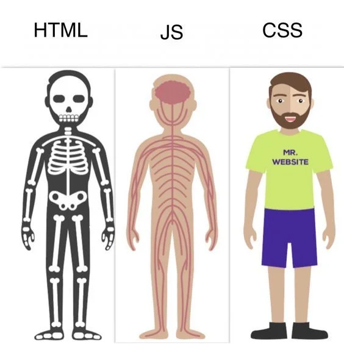

# Mối quan hệ giữa HTML - CSS - JavaScript

- Trong lập trình web, HTML CSS và JS là những thành phần không thể thiếu trong quá trình xây dựng nên một trang web và làm cho nó có thể hoạt động và tương tác được. Chúng có mối quan hệ chặt chẽ với nhau

- Nếu xem trang web như một cơ thể hoàn chỉnh thì:

  - `HTML`: Là khung xương, tạo nên cấu trúc và định hình cho trang web
  - `CSS`: Là lớp da bên ngoài, đóng vai trò là phần trang trí, làm cho web trông thẩm mỹ hơn, nhìn đẹp mắt hơn, màu sắc hơn
  - `JS`: Là hệ thần kinh, có thể thao túng và điều khiển được mọi thứ, có thể làm thay đổi html và cả css, hay kết hợp chúng với nhau để tạo thành những trang web có chức năng cụ thể, tương tác lại được với người dùng

    
