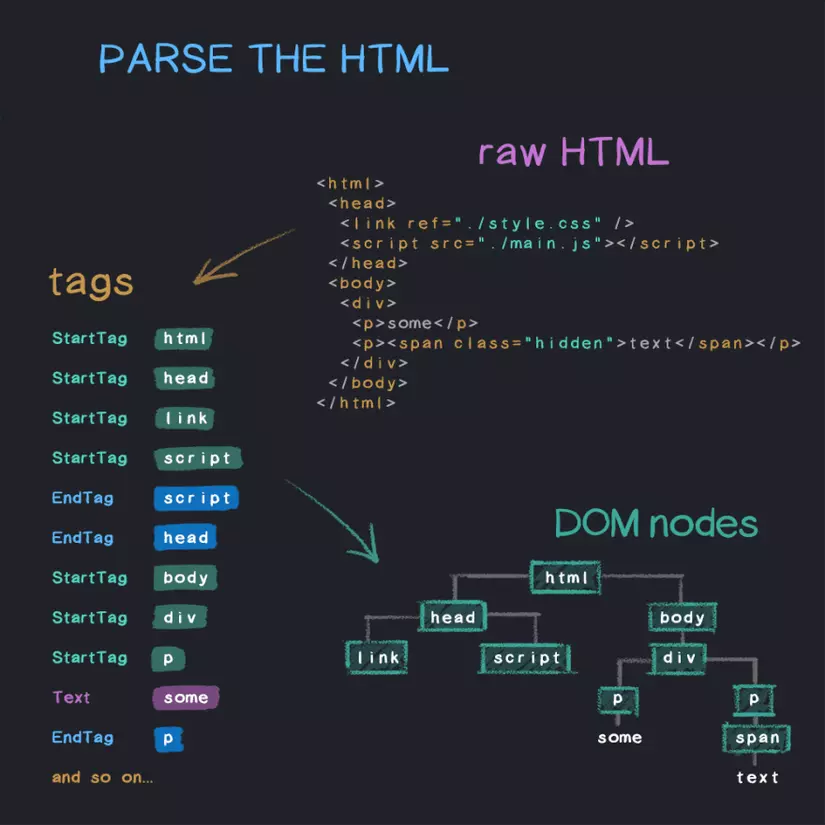
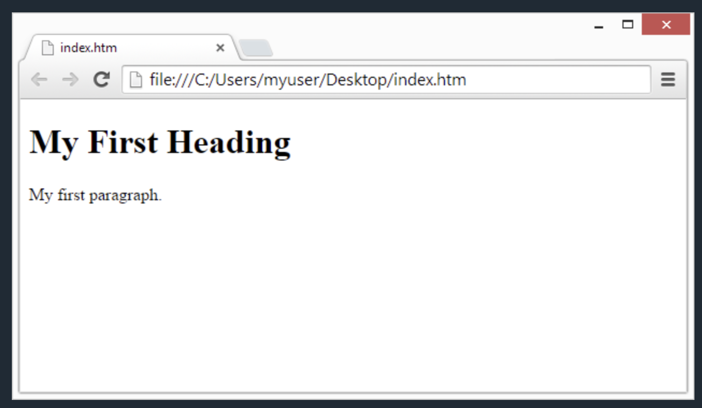
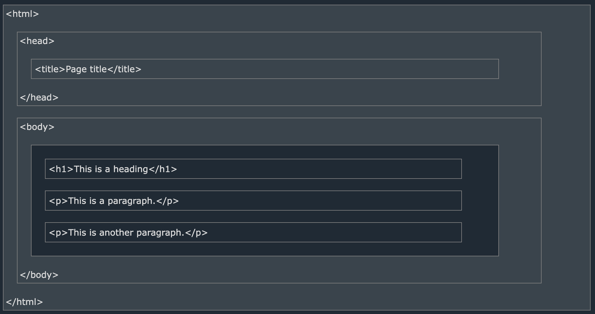
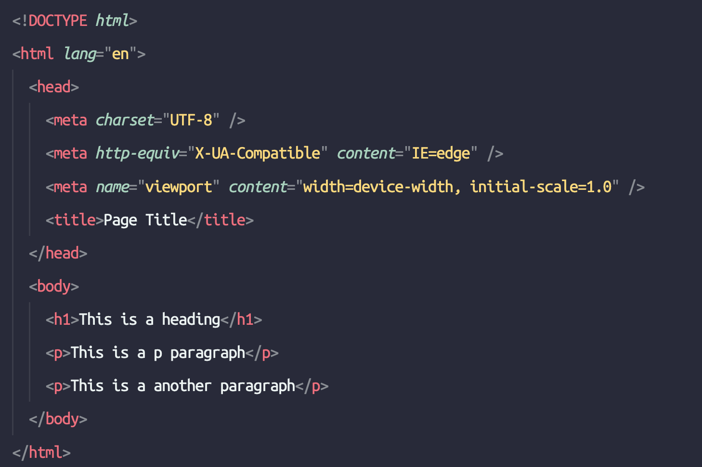

# HTML

## Định nghĩa

- Viết tắt của Hyper Text Markup Language => Ngôn ngữ đánh dấu siêu văn bản dùng để xây dựng nên phần khung sườn cho trang web có cấu trúc từ đơn giản đến phức tạp sử dụng các cặp thẻ (tags) để markup các thành phần (in đậm, in nghiêng, liên kết, tiêu đề, vùng chứa)
- HTML không phải là ngôn ngữ lập trình, nó chỉ có chức năng định nghĩa nên layout của trang web và phần khung của các element
- Phiên bản hiện tại mà đa phần các browser hỗ trợ là `HTML 5`

## Browser load một file html như thế nào ?

- Sau khi nhận được file html được trả về từ server, parser trong file html sẽ thực hiện việc parse code html và build lên cây DOM (Document Object Model).
- Các link external resource cũng sẽ được load theo sau đó để tải những thư viện, thành phần khác cho việc xây dựng layout trang web

## DOM là gì ?

- Viết tắt của Document Object Model
- Đại diện của một element trong file html

## Cấu trúc cơ bản

- Cấu trúc file html có những phần chính

  - 1 file html chứa các cặp tag và có thể có các thẻ lồng nhau theo từng cấp để định hình nên một layout web

  - `<!DOCTYPE html>`: Đây không phải là tag html bình thường. Đây chỉ là phần khai báo bắt buộc cho browser biết đây là một file HTML và browser có thể dịch file này ra để build trang web

  - `html`: Đây là cặp thẻ root của file html. Nó ở ngoài cùng và bọc tất cả các thứ có trong trang web cụ thể là 2 phần chính head và body

  - `head`: Chứa các thẻ meta phục vụ việc cấu hình cho trang web. Chứa thẻ title để hiển thị tên trang web trên trình duyệt. Chứa các link external resource để import sau này khi cần sử dụng

  - `body`: Phần thân của file html, nó chỉ xuất hiện một lần và bọc tất cả các thẻ tạo nên layout của trang web bên trong. Sau này khi style hay dùng JS xử lý cho thẻ này đồng nghĩa nó có thể effect lên toàn bộ các phần tử con bên trong

## CSR & SSR

- Sau này khi tối ưu tốc độ tải web, người ta dùng tới khái niệm CSR và SSR tuỳ thuộc vào mục đích của trang web (langding page hay dashboard page)
