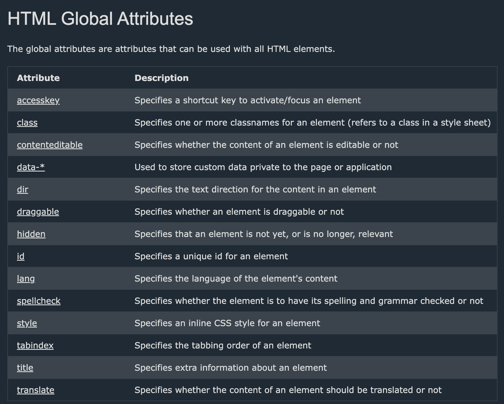

# Element - Tag - Attribute

## Tag

- Đại diện cho một element trên layout web
- Thường bắt đầu bằng một thẻ mở, một thẻ đóng, ở giữa có thể chứa nội dung hoặc không, và tên tag nằm trong thẻ mở hay thẻ đóng phải giống nhau
  ```html
  <tagname>content</tagname>
  ```
- Có 2 loại tag:

  - **Normal tag**: Những tag này có thẻ đóng và thẻ mở đầy đủ

    ```html
    <h1>Daily News</h1>
    <p>Hello world</p>
    ```

  - **Self closing tag**: Những tag này không có thẻ đóng, nó chỉ có thẻ mở và dùng dấu `/` để đại diện cho thẻ đóng

    ```html
    <input />
    <br />
    <hr />
    
    <link />
    ```

## Element

- Một element bản chất là một tag có đầy đủ thẻ mở thẻ đóng định nghĩa nên nó và có bọc nội dung bên trong

  ```html
  <tagname> Content or data... </tagname> : HTML Element
  ```

- Những element không có thẻ đóng hay không có content ở giữa thì gọi là element rỗng (empty element)

  ```html
  <tagname /></tagname> : Empty Element
  <tagname /> : Empty Element
  ```

## Attribute

- Mỗi một thẻ sẽ có các attributes dùng để cấu hình thuộc tính cho nó tuỳ theo mục đích sử dụng của thẻ đó là gì

  ```html
  

  <a href="google.com" target="_blank">Google</a>
  ```

- Bên các attribute đặc trưng cho mỗi thẻ thì sẽ có các global attribute.

  

- Custom attribute: Ta có thể add thêm các attribute custom cho html element theo cú pháp `data-*`

  ```html
  <ul>
    <li data-animal-type="bird">Owl</li>
    <li data-animal-type="fish">Salmon</li>
    <li data-animal-type="spider">Tarantula</li>
  </ul>
  ```

  Đoạn css này sẽ chọn element theo custom attribute và áp dụng css lên nó

  ```css
  ul > li[data-animal-type='bird'] {
    color: red;
  }
  ```
