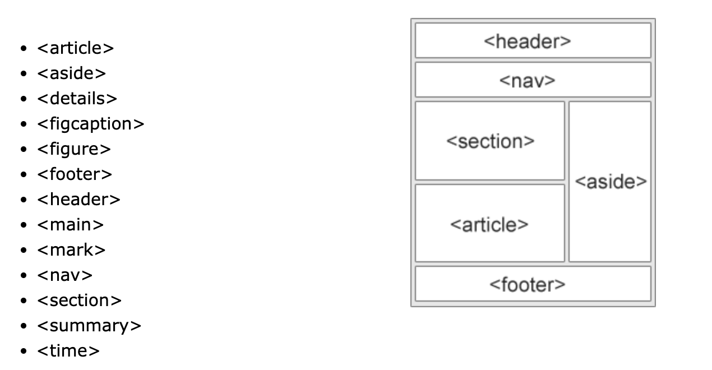
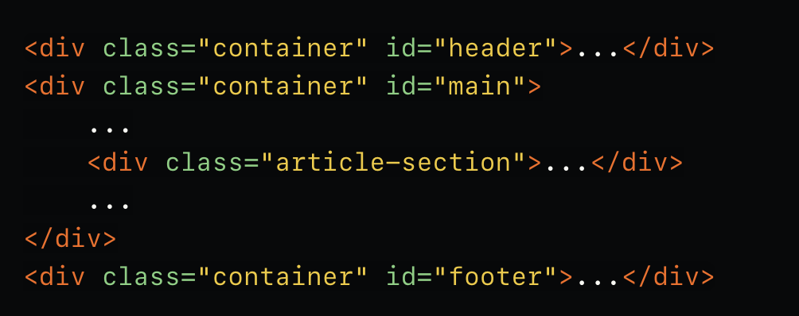
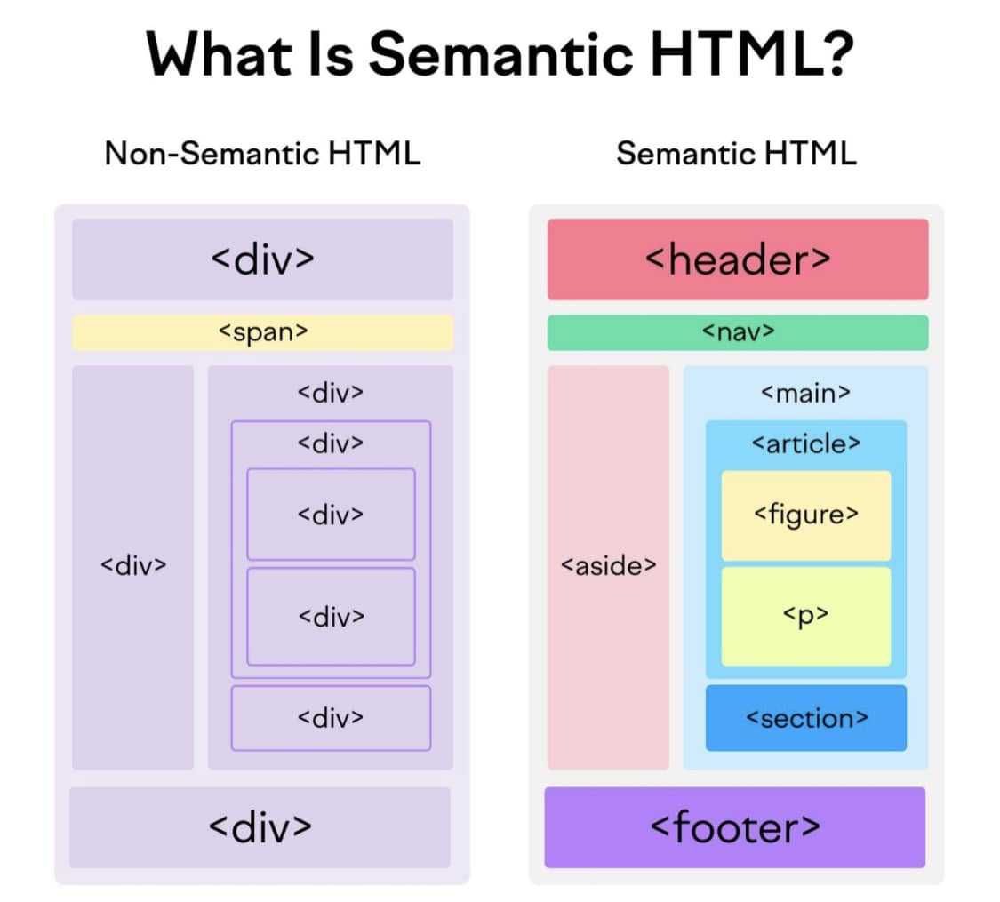

# Semantic HTML tags

## Semantic là gì ?

- Trước giờ khi code html ta thường dùng các thẻ div để dựng layout và các thẻ chứa `

` để hiển thị nội dung → Đây là cách truyền thống

- Ngày nay HTML5 cung cấp thêm các thẻ semantic để bổ sung về mặt ngữ nghĩa cho các html tag (nhìn vào ta sẽ biết được tag đó đại diện cho phần nào trong layout, trước đây chỉ toàn là div)

  

- Thay vì định nghĩa các container bằng một loạt các thẻ div thì ta sẽ thay thế bằng các thẻ semantic theo từng vai trò của component trên layout web

- Kiểu viết HTML thông thường:
  

- Sẽ được thay thế bằng kiểu viết sử dụng semantic HTML:
  

## Tổng kết

