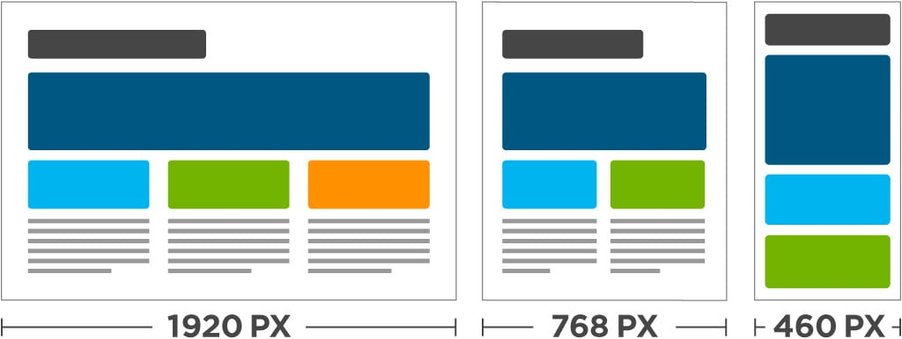

# Responsive layout

- Responsive layout là việc xây dựng các component của một trang web có thể co dãn và thay đổi kích cỡ tuỳ theo kích thước màn hình nhưng không bị vỡ layout

  

- Việc triển khai response như remake lại một layout web và tuỳ vào mục đích của hệ thống mà ta có triển khai responsive hay không. Có những layout khi responsive xong sẽ không còn đáp ứng được yêu cầu cốt lõi ban đầu nữa.

  
