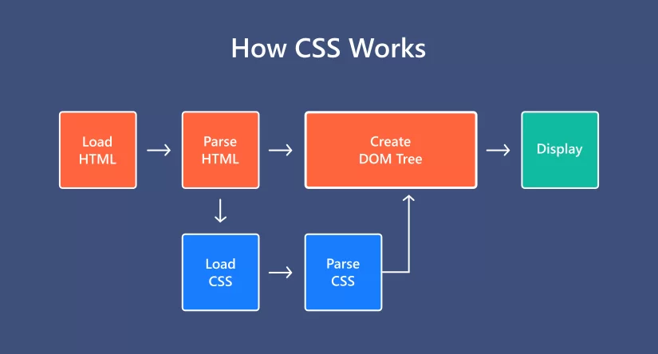

# CSS là gì ?

- Viết tắt của Cascading StyleSheet
- CSS là ngôn ngữ dùng để trang trí (style) cho các phần tử html
- Một element HTML khi hiển thị lên giao diện web sẽ là một phần thô. Và CSS sẽ quyết định cách mà một HTML element được hiển thị (theo phong cách nào, màu sắc như thế nào, vị trí ở đâu,...)

## Cách hoạt động

