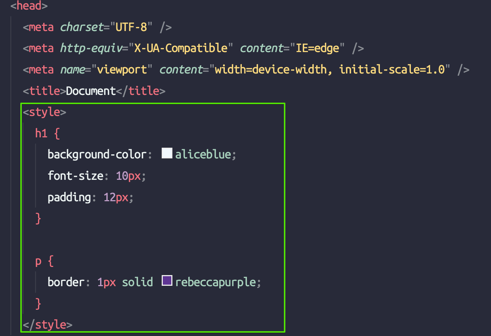
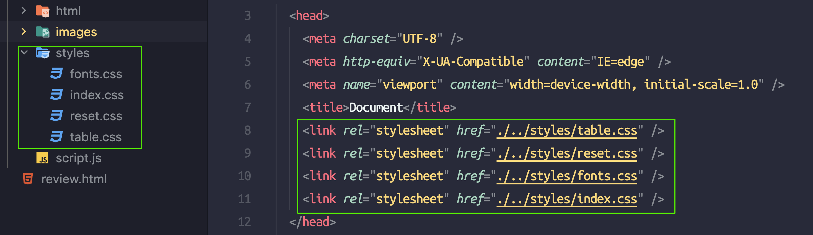
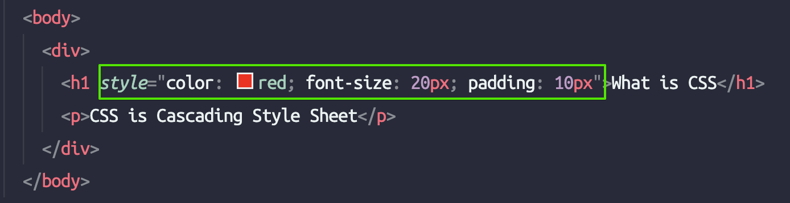

# CSS là gì ?

- Viết tắt của Cascading StyleSheet
- CSS là ngôn ngữ dùng để trang trí (style) cho các phần tử html
- Một element HTML khi hiển thị lên giao diện web sẽ là một phần thô. Và CSS sẽ quyết định cách mà một HTML element được hiển thị (theo phong cách nào, màu sắc như thế nào, vị trí ở đâu,...)

## Cách hoạt động

- Sau khi browser nhận được file html và trình duyệt bắt đầu parse HTML thành cây DOM, khi nào parse đến các link tải external resource cụ thể là css thì cùng thời điểm đó nó cũng sẽ load file CSS về và bắt đầu parse CSS thành CSSOM (Css Object Model) và apply lên các html element tương ứng theo độ ưu tiên css (css priority)
- `CSS is render-blocking`: Quá trình tải và thực thi CSS sẽ ngăn chặn việc hiển thị giao diện lên viewport cho đến khi xây dựng được CSSOM (render-blocking) chứ không ngặn chặn việc parser của browser parse code html thành cây DOM (parser-blocking)

## Cách sử dụng CSS

Có 3 cách để sử dụng được CSS

### 1. Internal (nội tuyến - nội bộ)

- Code CSS sẽ được đặt trong cặp thẻ `<style>` và thẻ này nằm trong thẻ `<head>`
- Cách này có hiệu quả khi làm việc trong các dự án có độ nghiêm ngặt cao và không cho import hay tải bất cứ file hay link nào từ bên ngoài vào.
- Đôi lúc sẽ trở nên bất tiện khi số lượng dòng code của css nhiều lên (đa phần các dự án dù có đơn giản thì cũng sẽ rất nhiều).
- Khó debug và tìm lỗi cũng như code thêm css mới

### 2. External (Ngoại tuyến)

- Code CSS sẽ được chia ra thành các file có đuôi `.css` và được import vào file html thông qua thẻ `<link rel=”stylesheet”  src=”” />`
- Đây là cách thông dụng nhất và hữu ích nhất khi có thể chia tách code css thành các phần giúp dễ quản lý và bảo trì
- Rất dễ thêm / bớt các bộ style css được viết sẵn và tách bạch nhau

### 3. Inline

- Đây là cách viết style trực tiếp trong thẻ HTML
- Thường là biện pháp cuối cùng trong trường hợp bất khả kháng vì cách này sẽ làm code html bị scale và phức tạp lên nhiều dẫn đến bị rối cho dev và bị nặng file
- CSS được viết inline trong thẻ html sẽ không thể tái sử dụng được. Và với những element có style giống nhau và được viết theo kiểu inline như thế này khi muốn sửa sẽ phải đi từng chỗ để sửa

