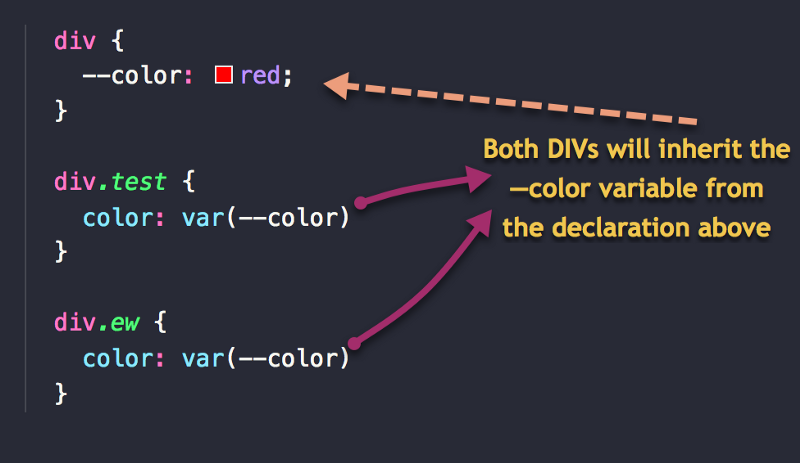
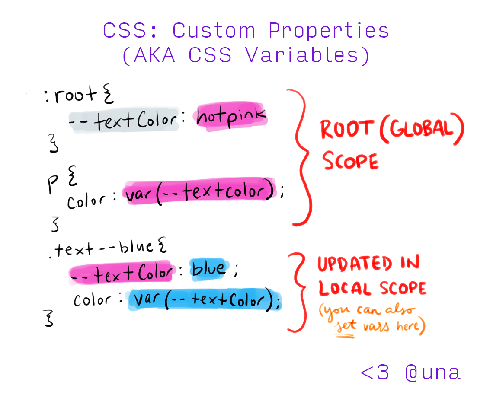

# CSS Variable

## Định nghĩa

- CSS cho phép ta đặt các giá trị thành một biến (variable) để có thể sử dụng lại

- Để đặt biết trong CSS ta dùng một "nơi" để khai báo và chứa các biến, đó là pseudo class `::root`, các cặp key-value trong pseudo class này sẽ tương ứng với các variable mà ta định nghĩa

- Khi sử dụng ta sẽ dùng keyword `var()` và truyền param là variable ta đã định nghĩa ở pseudo root

  ```css
  :root {
    --text-color: red;
    --primary-padding: 10px;
    --primary-margin: 20px;
    --primary-background: teal;
  }

  h1 {
    color: var(--text-color);
  }

  .box {
    background-color: var(--primary-background);
  }
  ```

## Công dụng

- Công dụng bậc nhất của css variable vẫn là để có thể reuse lại và dễ kiểm soát trong việc thay đổi

- Việc reuse có thể áp dụng cho nhiều thành phần khác nhau nhưng có chung giá trị thuộc tính css hay theo một concept nào đó

- Khi có thay đổi style của nhiều thành phần thì nhờ vào css variable ta chỉ cần sửa một chỗ thôi và những chỗ khác sẽ được cập nhật theo

  

## Fallback Value

- Khi các variable không có sẵn hoặc không hợp lệ, thì những giá trị fallback value sẽ được sử dụng như là giá trị mặc định để tránh lỗi giao diện

  ```css
  .header-title {
    /* Red if --my-var is not defined */
    color: var(--my-var, red);
  }

  .login-button {
    /* pink if --my-var and --my-background are not defined */
    background-color: var(--my-var, var(--my-background, pink));
  }
  ```

## Scope

- Scope của CSS variable được chia làm 2 loại: global và local

  - Các biến được khai báo trong `::root` là biến global, có thể sử dụng và gọi được bất cứ đâu trong file css
  - Các biến được khai báo trong 1 selector hay 1 block code {} thì sẽ chỉ có phạm vi sử dụng đc trong block đó thôi. Selector khác hay block khác sẽ không thể truy cập được để dùng

    
