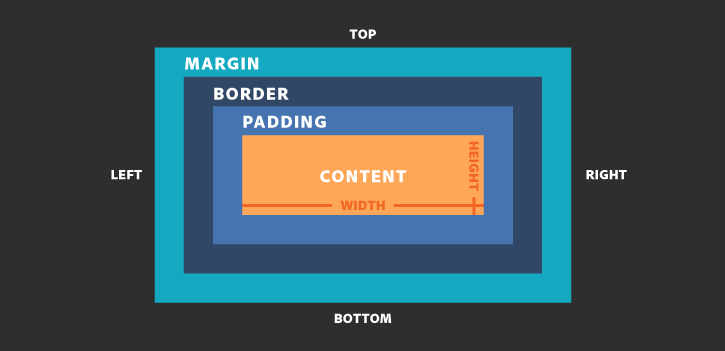
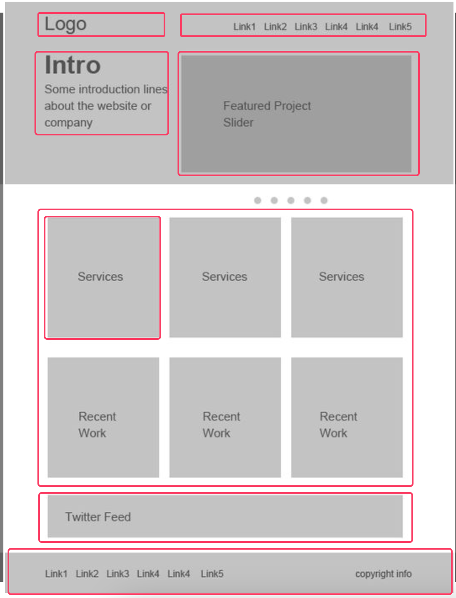

# Box Model

## Định nghĩa
- Khi code HTML ta đều cố gắng định nghĩa cho các element đó trở thành một box model trong layout, từ đó có thể dễ dàng thông qua các selector và các thuộc tính css để xử lý và quyết định cách nó hiển thị

## Thành phần
- Thành phần của một box model gồm có 4 phần:
  - `Content`: Phần nội dung của box model, có thể là text, hình ảnh, hay chỉ là khoảng trống,...
  - `Padding`: Phần khoảng cách giữa content đến border
  - `Border`: Là một đường bao bọc phần padding và content bên trong
  - `Margin`: Phần khoảng cách bên ngoài của box model. Giúp ngăn cách giữa box model này với box model khác trong layout

    

## Áp dụng trên layout

