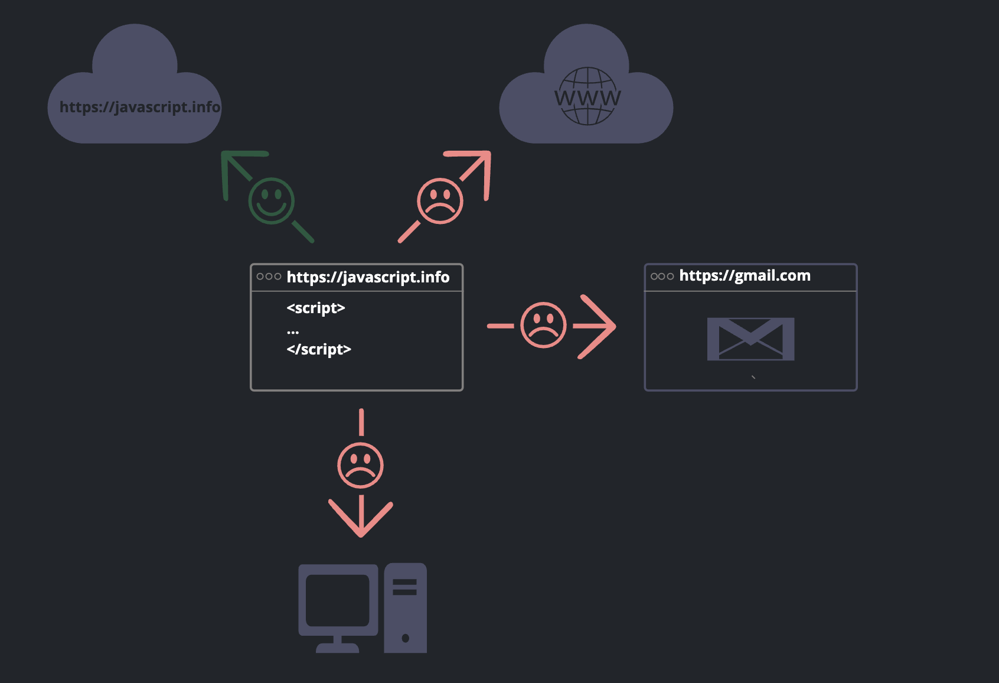
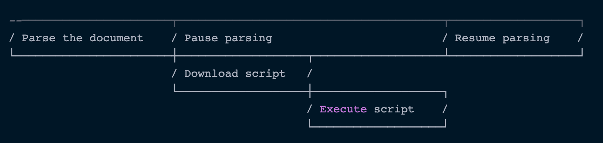
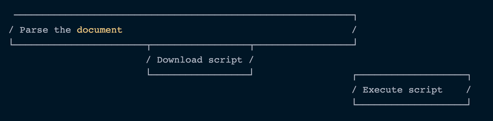
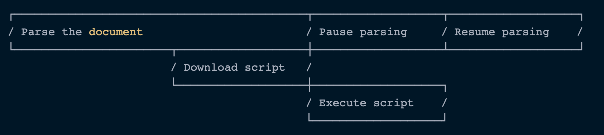
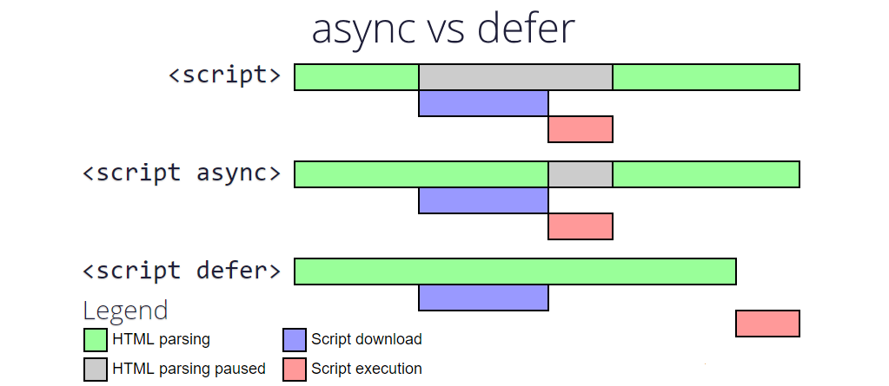

# Introduction

- JS là ngôn ngữ lập trình được tạo ra để khiến trang web trở nên tương tác được với người dùng thông qua những xử lý theo yêu cầu của người dùng và tính toán đưa ra sự thay đổi trên giao diện với các ưu điểm:

  - Chỉnh sửa cấu trúc HTML và thay đổi content của nó
  - Can thiệp vào style css và thay đổi các giá trị
  - Làm cho element có thể phản ứng lại với hành động của user dựa trên các sự kiện
  - Gửi request lên server để lấy dữ liệu về
  - Lưu trữ dữ liệu phía client (local storage, session storage, ...)

- JS là ngôn ngữ có phân biệt chữ hoa - thường:

  - Một biến tên `myVariable` sẽ khác biến tên `myvariable`
  - Một giá trị `myValue` sẽ khác giá trị `myvalue`

- Nhược điểm

  - JS chạy trong browser bị hạn chế vì tính năng của nó như con dao hai lưỡi có thể bị kẻ xấu lợi dụng thể gây thiệt hại ngược lại cho user (XSS,...)
  - Không truy cập được vào chức năng của hệ điều hành trên máy
  - Có thể kích hoạt tính năng mở camera, loa, location nhưng chỉ khi được user cấp quyền để hoạt động
  - JS có thể truy cập được vào các page khác nhau từ nhiều url khác nhau mặc dù nó nằm ở các tab khác nhau

    

## Vì sao JavaScript ?


- Khi JS được tạo ra, tên ban đầu của nó là "LiveScript". Tất nhiên `java` và `javascript` là 2 ngôn ngữ khác nhau hoàn toàn, thời gian này `Java` là một ngôn ngữ mạnh và phổ biến. Nên người tạo ra ngôn ngữ này sẽ quyết định "dựa trend" Java như một phiên bản mới của Java, từ đó cái tên JavaScript ra đời

- JS ngày nay không chỉ chạy được trên trình duyệt, nhờ một môi trường thực thi (NodeJS) JS bây giờ có thể chạy đa nền tảng như ở phía server hoặc các thiết bị khác

## JavaScript được thực thi như thế nào trên trình duyệt

- Code JavaScript được compile bằng browser engine, được gọi là "JavaScript Virtual Machine". Thường các trình duyệt khác nhau sẽ có các tên engine khác nhau:

  - Chrome, Opera, Edge: V8 engine
  - Firefox: SpiderMonkey
  - Safari: Nitro và SquireelFish
  - IE: Chakra

  => Đó là lí do khi có các tính năng mới của ngôn ngữ, JS, HTML CSS, sẽ có những browser chưa được support hoàn toàn. Tính năng mới sẽ hoạt động không ổn định hoặc gây lỗi nếu sử dụng

- Quá trình thực thi code:
  - Khi trình duyệt tải file html, nó sẽ tải theo các file js về và tuỳ vào option sẽ quyết định thứ tự mà những file js đó được thực thi
  - Browser engine sẽ parse code JS
  - Convert code JS thành ngôn ngữ máy
  - Chạy và thực thi code đã biên dịch

## Import JavaScript

- Khi browser parse code HTML để render layout và gặp thẻ script. Thì việc render của browser sẽ bị block lại để chờ cho script tải về và thực thi xong rồi mới render tiếp vì code js có thể can thiệp và chỉnh sửa content hay cấu trúc HTML, và browser cần bảo đảm thực thi tất cả việc đó trước khi render ra layout.

- Có 2 cách để có thể sử dụng JS trong html:

  - **External**: Import các file js từ bên ngoài vào thông qua thẻ `<script></script>` đi kèm các attributes để config cho việc tải và thực thi code js:

    - src: Đường dẫn liên kết đến file js cần tải
    - type: Định nghĩa script thuộc loại ngôn ngữ nào.

      - Download: Tuỳ theo mục đích để điều chỉnh cho việc này, thẻ `<script></script>` cung cấp các attributes khác nhau để tối ưu việc tải và thực thi trang web:

        - `default`: Mặc định khi browser parse đến các thẻ script thì các file js nằm trong thẻ script sẽ được browser tải về theo cơ chế synchronous (đồng bộ). Sau khi tải xong sẽ thực thi luôn. Thế nên browser sẽ phải đợi script tải về, thực thi xong mới có thể tiếp tục render layout. Cách này sẽ dẫn đến 2 vấn đề:

          - Script nếu có chứa logic can thiệp thay đổi content hay html sẽ không thể tìm thấy DOM (vì lúc này có thể chưa được build xong) nên không thể add các hàm xử lý.
          - Vì file script thường có dung lượng nặng hơn file html nên việc download sẽ tốn thời gian hơn. Nên nếu nó được để ở đầu trang (trong thẻ head) thì nó sẽ block toàn bộ việc render cho đến khi việc download và thực thi hoàn thành. Đó cũng là lí do vì sao ta hay đặt cặp thẻ script ở dưới cùng của `body` chứ không phải trong thẻ `head`.

            

        - `defer (hoãn)`:

          - Browser sẽ vừa tải script chạy nền và vừa render layout. Script tải xong sẽ bị hoãn việc thực thi lại.
          - sau khi render layout xong thì script mới được thực thi. Lúc này cây DOM được build xong và đã sẵn sàng
          - Option này không không block việc render page

            ```html
            <script
              defer
              src="https://javascript.info/article/script-async-defer/small.js"
            ></script>
            ```

            

        - `async (asynchronouse - bất đồng bộ)`:

          - Browser sẽ vừa tải script chạy nền và vừa render layout
          - Nếu có nhiều script, các script sẽ không đợi nhau mà cùng tải song song
          - Ngay sau khi download xong, script sẽ được thực thi ngay lập tức. Đến lúc này quá trình render mới dừng lại để đợi js thực thi

            ```html
            <script
              async
              src="https://javascript.info/article/script-async-defer/small.js"
            ></script>
            ```

            

  ### Tổng kết

  

  - **Internal**: Có thể viết code JS trực tiếp trong file HTML bằng cặp thẻ script

    ```html
    <script>
      console.log('Say Hello Javascript');
    </script>
    ```
