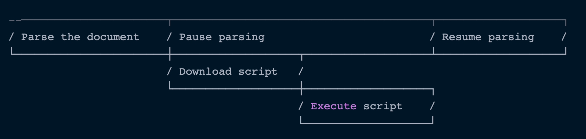

# HTML script tag

Phần này sẽ tập trung chi tiết hơn về thẻ `<script></script>` hỗ trợ cho việc tìm hiểu cách mà script hoạt động khi được tải về, tương tác với file html và thực thi trên trình duyệt.

## Attributes

- src: Đường dẫn liên kết đến file js cần tải
- type: Định nghĩa script thuộc loại ngôn ngữ nào, áp dụng cho kiểu sử dụng internal import. Ta sử dụng JS làm ngôn ngữ chính của script nên giá trị của nó sẽ là `type="application/javascript"`
- defer & async: Quyết định việc tải và thực thi script. Đây là phần quan trọng trong bài này và sẽ tìm hiểu ở phần dưới

## Cơ chế hoạt động của thẻ script

Có 2 cách để sử dụng được js trong file html là _internal import_ và _external import_. Trong đó _external import_ sẽ có nhiều điểm cần chú ý và cần hiểu về cách hoạt động của nó

- `default`:

  - Mặc định khi browser parse đến các thẻ script thì các file js nằm trong thẻ script sẽ được browser tải về theo cơ chế synchronous (đồng bộ). Sau khi tải xong thì sẽ thực thi luôn, tất cả việc này sẽ block việc render layout của browser và browser cần bảo đảm tất cả việc đó được hoàn thành trước khi render ra layout. Khi script được thực thi xong thì browser mới có thể tiếp tục render. Cách này sẽ dẫn đến 2 vấn đề:

    - Script nếu có chứa logic can thiệp thay đổi content hay html sẽ không thể tìm thấy DOM (vì lúc này có thể chưa được build xong) nên không thể add các hàm xử lý và làm trang web hoạt động sai hoặc hiển thị sai.
    - File script thường có dung lượng nặng hơn file html nên việc download sẽ tốn thời gian hơn. Nên nếu nó được để ở đầu trang (trong thẻ head) thì nó sẽ block toàn bộ việc render cho đến khi việc download và thực thi hoàn thành. Đó cũng là lí do vì sao ta hay đặt cặp thẻ script ở dưới cùng của `body` chứ không phải trong thẻ `head`.

  - Trường hợp sử dụng:
    - Các website vừa và nhỏ, có các chức năng đơn giản, không quá phức tạp
    - Website có ít link script cần tải

  ```html
  <script src="https://javascript.info/article/script-async-defer/small.js"></script>
  ```

  

- `defer (hoãn)`:

  - Attribute này không block việc render page. Việc tải script sẽ được chạy nền trong khi browser tiếp tục render layout. Script tải xong sẽ không thực thi ngay mà bị hoãn lại.

  - Sau khi layout được render xong thì script mới được thực thi. Lúc này cây DOM được build xong và đã sẵn sàng

  - Attribute này thường được sử dụng khi:

    - Số lượng file script nhiều, phụ thuộc nhau và cần thời gian dài để download
    - Logic của script thao tác nhiều đến cây DOM, cần defer cho đến khi cây DOM hoàn chỉnh
    - Cần tải script thư viện trước, và script logic sau để sử dụng -> Defer script logic

  - Trường hợp sử dụng:
    - Website hoạt động trong điều kiện kết nối internet không ổn định
    - Các website tập trung nhiều về phần UI, ưu tiên hiển thị UI nhanh nhất có thể, sau đó mới đến các chức năng
    - Website có nhiều link script nặng hoặc số lượng code JS nhiều và phức tạp, cần tối ưu performance lúc tải và hạn chế block render page
    - Website cần tải script của thư viện, tiện ích bên thứ 3

  ```html
  <script
    defer
    src="https://javascript.info/article/script-async-defer/small.js"
  ></script>
  ```

  

- `async (asynchronous - bất đồng bộ)`:

  - Browser sẽ vừa tải script chạy nền và vừa render layout
  - Nếu có nhiều script, các script sẽ không đợi nhau mà cùng tải song song
  - Ngay sau khi download xong, script sẽ được thực thi ngay lập tức. Đến lúc này quá trình render mới dừng lại để đợi js thực thi
  - Trường hợp sử dụng:

    - Các project sử dụng công nghệ SPA
    - Tải những script hỗ trợ bên ngoài như google ads,...

  ```html
  <script
    async
    src="https://javascript.info/article/script-async-defer/small.js"
  ></script>
  ```

  

## Kết luận


