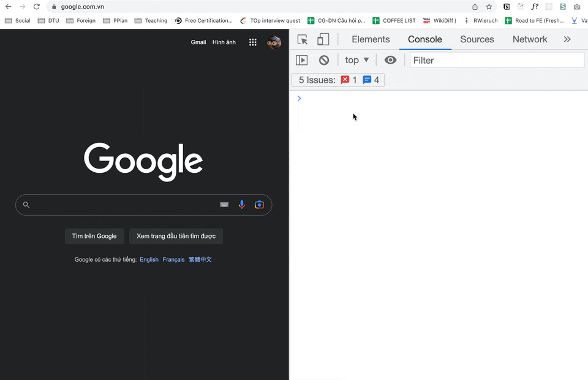
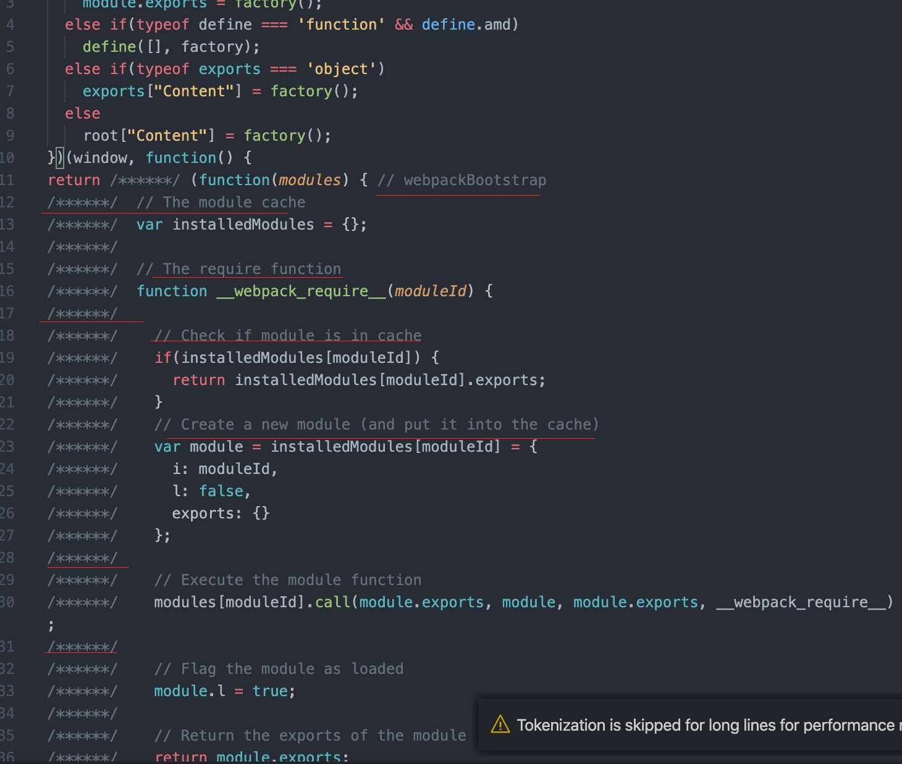

# Code Structure

- Các thành phần cấu tạo nên một file code

## Statements

- Là một cấu trúc syntax dùng để biểu diễn cho một hành động cụ thể
- Một tập các statement phối hợp với nhau theo một logic thì sẽ được gọi là một hàm (function)
- Vd: Khi viết `alert('hello')` thì statement này sẽ ra lệnh cho máy tính hiện hộp thoại cảnh báo có nội dung 'hello'



## Block code

- Một block code được phân định trong cặp dấu `{}`
- Dùng để group 1 hoặc nhiều câu lệnh lại để thực hiện một hoặc một chuỗi hành động có mục đích
- Đại diện cho thành phần này gồm các câu lệnh điều kiện if else hoặc câu lệnh lặp for

```js
if (weather === 'rain') {
  console.log('I will at home');
} else {
  console.log('I will go to coffee shop');
}

for (let i = 0; i < 100; i++) {
  console.log(i);
}
```

## Semicolons (;)

- Dấu `;` dùng để kí hiệu kết thúc một câu lệnh
- Trong một file gồm nhiều dòng code thì các câu lệnh sẽ ngăn cách với nhau bằng dấu `;`.
- Ở nhiều ngôn ngữ nếu không có dấu `;` thì sẽ báo lỗi. Riêng JS có hỗ trợ không cần thêm `;` vì nó đã ngầm định thêm vào. Nhưng theo quy ước thì vẫn nên thêm để code dễ đọc hơn

```js
  alert('Hello'); alert('World');

  alert('Hello');
  alert('World');
```

## Comment

- Càng comment ít càng tốt
- Vốn dĩ code clean là code dễ đọc và không cần phải comment gì thêm
- Chỉ comment khi thực sự cần thiết:

  - Viết document hướng dẫn flow cho chỗ code đó nếu nó có logic phức tạp
  - Các yếu tố cần setup trước để chỗ code đó có thể hoạt động được
  - Một số convention project bắt buộc khai báo code author, mục đích của đoạn code,...


- Có 2 loại comment
  - Comment single line (//)
    ```js
    // console.log('this line is commented')
    ```
  - Comment multiple lines (/\*\* \*/)
    ```js
    /**
     * Comment line 1
     * Comment line 2
     * ...
     */
    ```
