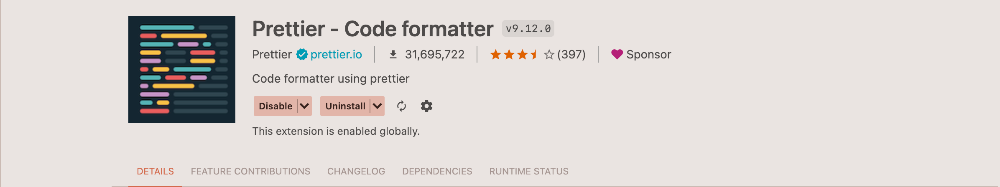
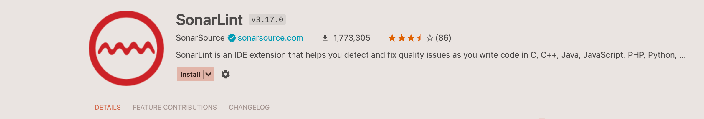
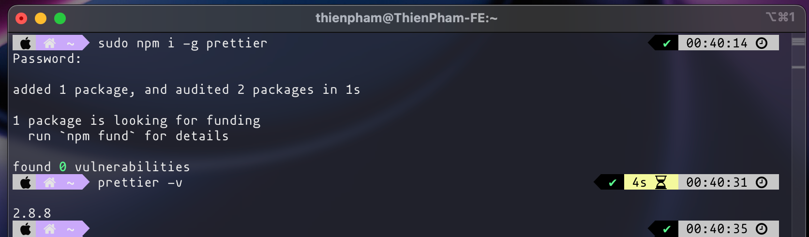
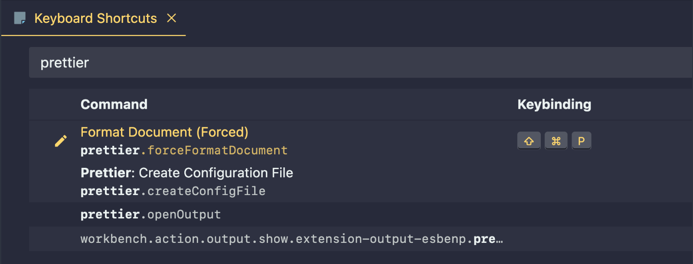
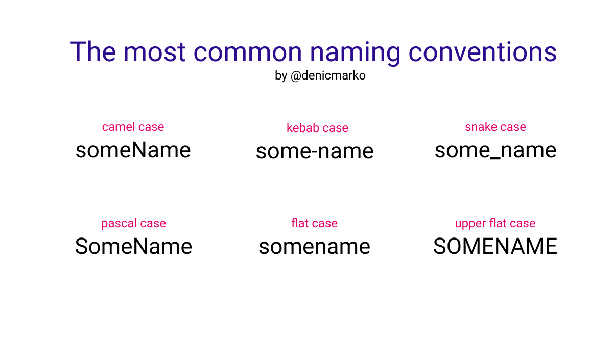
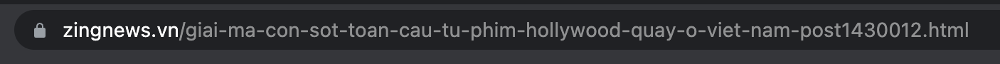

# Clean code

> Viết code cũng như viết chính tả. Đúng chính tả thì câu từ mới hay và có nghĩa. Cũng như code có clean thì mới dễ đọc fix lỗi và tối ưu hệ thống

## Clean code là gì ?

- Clean code là một các nguyên tắc đã được nghiên cứu và đúc kết qua thời gian dài. Gồm bộ các nguyên tắc trong việc trình bày và triển khai cấu trúc code, logic sao cho dễ đọc dễ bảo trì nhưng cũng ngắn gọn và không dài dòng khi số lượng code và file trong một project vốn dĩ đã quá khổng lồ và phức tạp.

- Ngày nay đã có những thư viện hay công cụ như prettier, eslint, sonarlint, việc của dev chỉ cần tập trung vào phát triển logic. Còn lại chất lượng code hay đánh giá logic sẽ có các thư viện này hỗ trợ

  
  
  

## Clean code vs Bad code ?

- Một đoạn code được đánh giá là clean hay bad dựa trên nhiều yếu tố như cách trình bày, cách define vấn đề và triển khai logic để giải quyết vấn đề (syntax & logic)

  ### Logic quality

  - Bad code:

    ```js
    console.log(1);
    console.log(2);
    console.log(3);
    console.log(4);
    console.log(5);
    console.log(6);
    console.log(7);
    console.log(8);
    console.log(9);
    console.log(10);
    ```

  - Good code:
    ```js
    for (let i = 1; i <= 10; i++) {
      console.log(i);
    }
    ```

  ### Syntax quality

  - Bad code:
    <!-- prettier-ignore -->
    ```html
    <div><h1>Header</div><div><p>content</p>
      </div>
    </div>
    ```

  - Good code:
    ```html
    <div>
      <h1>Header</div>
      <div>
        <p>content</p>
      </div>
    </div>
    ```

## Cải thiện clean code

- Để nâng cao khả năng viết clean code:
  - **Logic quality**: Không ngừng luyện tập nâng cao khả năng tư duy logic, giải quyết vấn đề bằng cách tìm hiểu nghiên cứu các thuật toán và triển khai nhiều ví dụ giải quyết vấn đề bằng việc coding
  - **Syntax quality**: Việc trình bày code sạch đẹp rất quan trọng và nên được hình thành thói quen càng sơms càng tốt. Hiện nay có Prettier extension (sẽ tìm hiểu ở dưới) rất phổ biển phục vụ việc format lại code theo config giúp tiết kiệm thời gian cho dev trong việc coding mà vẫn đảm bảo clean

### Prettier (https://prettier.io)


Đây là extension giúp format code cho dev theo style định sẵn trong file config. Hiện tại chỉ cần install global trong máy mà sử dụng. Sau này khi vào dự án, tuỳ vào mỗi dự án mà ta sẽ config sau.

#### Installation

```bash
  npm i -g prettier && prettier -v
```



#### Cài phím tắt để chạy prettier format code style

- Khởi động VSCode
- Gõ tổ hợp phím `Cmd + P` trên macOS hoặc `Ctrl + P` trên Windows.
- Một popup tìm kiểm sẽ hiện ra. Gõ lệnh `>keyboard` và chọn dòng `Preferences: Open Keyboard Shortcuts`
- Trong cửa sổ bật lên click đúp mục `Format Document (forced)`

- Một hộp thoại hiện ra, nhấn tổ hợp phím mong muốn, vd: `Cmd + Shift + P`

  

- tạo một file html và copy đoạn code xấu ở dưới, nhấn thử tổ hợp phím vừa cài đặt ở trên

  ```
          <!DOCTYPE html>
    <html     lang="en">
    <head>
              <meta     charset="UTF-8">
                  <meta     http-equiv="X-UA-Compatible"
            content="IE=edge">
              <meta         name="viewport"

                    content="width=deviceconteh, initial-scale=1.0">
      <title> Demo Prettier         </title>
    </head>
      <body>
    <h1>Hello World     </h1>
                                  <p>
            This code
                is super super
                bad
          </p>
    </body>
    </html>
  ```

### Naming Everything

- Cách đặt tên rất quan trọng trong quá trình code và phát triển ứng dụng:

  - Đặt tên biến tốt sẽ biết được biến đó đang lưu giữ giá trị gì, có quan trọng không
  - Đặt tên hàm tốt sẽ biết được hàm đó thực hiện chức năng gì, có gây ảnh hưởng gì trong hệ thống không
  - Đặt tên file/thư mục tốt sẽ biết được cấu trúc chức năng của hệ thống

    ```
    => Tất cả những việc trên sau cùng đều sẽ giúp ta kiểm soát được toàn bộ hệ thống đến từng đơn vị nhỏ nhất, dễ dàng sửa lỗi và bảo trì cũng như mở rộng hệ thống và phát triển thêm nhiều chức năng, bảo đảm hệ thống luôn chất lượng về hiệu suất cũng như chức năng
    ```

### Semantic naming

- Operators: Đa số các toán tử nên viết có khoảng cách đầu và đuôi để tách biệt và dễ đọc

  ```js
  <!-- Bad -->

  if(age>30) {}
  const username = profileName??loginName;

  <!-- Good -->
  if(age > 30) {}
  const username = profileName ?? loginName;
  ```

- Normal variable: Đặt tên biến có nghĩa, dễ nhớ, đại diện cho giá trị mà biến đang nắm giữ

  ```js
  <!-- Bad -->
  const x = 'application/javascript';

  <!-- Good -->
  const typeTag = 'application/javascript';
  ```

- Constant: Đặt tên cho hằng số sẽ cần viết hoa toàn bộ, nếu tên có nhiều từ sẽ dùng dấu `_` và khai báo bằng keyword `const`

  ```js
  <!-- Bad -->
  const numberFriend = 1;

  <!-- Good -->
  const NUMBER_FRIEND = 1;

  ```

- Boolean variable: Để đặt tên cho biến boolean ta sẽ dùng các từ tiếng Anh để phân biệt đúng - sai như `is, can, has, should` (Giống dạng yes - no question)

  ```js
  const isAuthenticated = true;
  const hasError = false;
  const canUpdate = false;
  const shouldLogout = true;
  ```

- Function

  - Vì function thường dùng để làm việc gì đó hay thực hiện một chức năng nào đó, ta sẽ dùng động từ để đặt tên cho nó

  ```js
    const getUserInformation() {}

    const goToPreviousPage() {}

    const saveDataToTable() {}

    const sayHello() {}

    const showImage() {}

    getUserInformation();
    goToPreviousPage();
    saveDataToTable();
    sayHello();
    showImage();

  ```

- Condition statements

  ```js
  if (isLikeMe === true) {
    console.log('happy');
  } else {
    console.log('crying...');
  }

  if (weather === 'rain') goToCoffeeShop();
  ```

### Naming Rules



> Tuỳ theo yêu cầu của mỗi dự án cũng như leader đề ra mà sẽ sử dụng các bộ rule linh hoạt cho từng trường hợp

#### kebab-case:

- Đặt cho các route
  

- Đặt tên cho các class, id dùng làm selector trong css

  ```css
  .main-header {
    color: red;
  }

  #username-pannel-top {
    background-color: blue;
  }
  ```

#### PascalCase: Tuỳ vào dự án mà sẽ dùng để đặt tên file, class - interface trong OOP,...

```js
class Student {}

class Teacher {}
```

#### camelCase: Dùng để đặt tên cho biến và hàm

```js
const firstName = 'Bee';

function getUserInfo() {}
```

#### snake_case: Đặt tên cho biến (Ít dùng trong JS)

```js
const first_name = 'Bee';

const student_age = 25;
```

#### Upper flat case

- Dùng để đặt tên cho các hằng số

  ```js
  const ROOT = 'admin';
  ```

- Có thể kết hợp với snake_case khi đặt tên biến có nhiều từ

  ```js
  const DEFAULT_SETTINGS = {};

  const CONECT_STATUS = 'ok';
  ```

### Code Indentation Breakline Spacing

- Code Indentation: Là độ thụt dòng của code, giú nhận biết việc một line code có nằm trong block code của một hàm hay có là thành phần con của một container bên ngoài nào đó không. Giá trị đơn vị thường sử dụng là 2 hoặc 4

  - HTML

    - Cách dùng indent sai
      ```
        <div>
        <p>Hello world</p>
        </div>
      ```
    - Cách dùng indent đúng
      ```
        <div>
          <p>Hello world</p>
        </div>
      ```
      ```
        <div>
            <p>Hello world</p>
        </div>
      ```

  - CSS

    - Cách dùng indent sai
      ```
      .main-header {
      color: red;
      padding: 10px;
      font-size: 10px;
      }
      ```
    - Cách dùng indent đúng

      ```
      .main-header {
        color: red;
        padding: 10px;
        font-size: 10px;
      }
      ```

      ```
      .main-header {
          color: red;
          padding: 10px;
          font-size: 10px;
      }
      ```

  - JS

    - Cách dùng indent sai
      ```
        function sayHello() {
        const userName = 'Peter';
        console.log('Say hello ' + userName);
        if(userName === 'Peter') {
        console.log('You are CEO');
        if(weather === 'rain') {
        console.log('rainy day')
        }
        }
        }
      ```
    - Cách dùng indent đúng

      ```
      function sayHello() {
        const userName = 'Peter';
        console.log('Say hello ' + userName);

        if(userName === 'Peter') {
          console.log('You are CEO');
          if(weather === 'rain') {
            console.log('rainy day');
          }
        }
      }
      ```

      ```
      function sayHello() {
          const userName = 'Peter';
          console.log('Say hello ' + userName);

          if(userName === 'Peter') {
              console.log('You are CEO');
              if(weather === 'rain') {
                console.log('rainy day');
              }
          }
      }
      ```

- Breakline: Các block code thường tách ra một dòng để dễ đọc hơn

  ```js
  function getUsername() {
    console.log('What is your name ?');
  }

  function showUserName(username) {
    console.log('Hello ' + username);
  }
  ```

### Be cafeful with Magic Number

#### Magic Number là gì ?

- Là các số bình thường nhưng nó được dùng trong các khối lệnh điều kiện (conditional statement) hay các phép tính toán.
- Được gọi là "magic" vì nó là một giá trị cứng (hard-code) không bao giờ thay đổi và không mang ý nghĩa rõ ràng, không biết được nó dại diện cho ai và có vai trò gì

  ```js
  const requestTimeout = 2 * 3600;
  const gender = 1;
  ```

#### Cách giải quyết

Ta sẽ định nghĩa các magic number thành các hằng số, vừa dễ nắm được ý nghĩa cũng như vai trò của biến, vừa có thể tái sử dụng ở nhiều nơi. Khi cần thay đổi giá trị cũng chỉ cần thay đổi ở một chỗ

Các developer mới vào dự án sau này đọc code cũng sẽ dễ hiểu hơn. Dễ dàng làm quen với công việc hơn

```js
const SECONDS_PER_MINUTE = 60;
const FEMALE = 0;
const MALE = 1;

let requestTimeout = 2 * SECONDS_PER_MINUTE;
const gender = FEMALE;
```

> Developer giỏi không chỉ là developer viết code cho máy tính hiểu. Developer giỏi là developer viết code cho developer khác hiểu.
