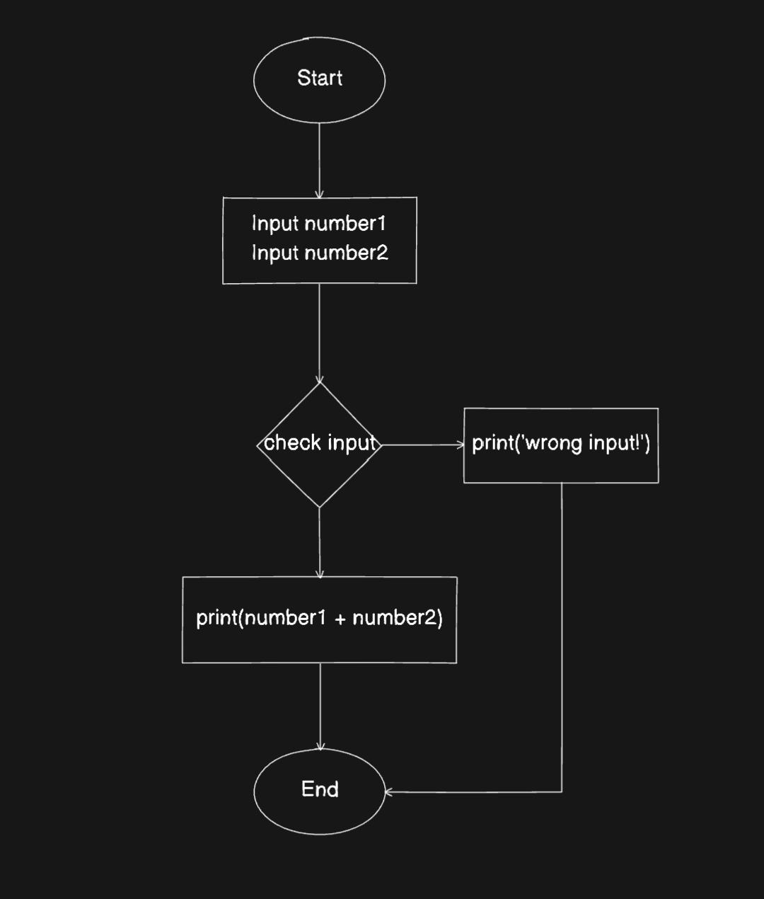

# Pseudo code

## Định nghĩa

- Pseudo code (code giả) là cách define ra giải pháp xử lý vấn đề của lập trình viên trước khi triển khai vào code thật

- Sự khác nhau ở đây là dev có thể dùng bất cứ ngôn ngữ nào để mô tả các step xử lý vấn đề, pseudo code này dùng để đọc-hiểu, không phải là một chương trình có thể compile để máy tính đọc hiểu và thực thi được

## Ví dụ Ví dụ viết một chương trình tính tổng, nhận vào 2 số nguyên khác 0 và trả ra kết quả của chúng

- Cách giải quyết (thuật toán):

  - Nhận vào 2 số nguyên
  - Kiểm tra xem 2 số đó có hợp lệ không
  - Nếu có thì cộng lại rồi trả ra kết quả
  - Nếu sai thì in ra thông báo "Wrong input!"

- Viết pseudo code:

  ```
    START
      INPUT number1
      INPUT number2

      IF number1 IS INT OR number2 IS INT
        PRINT number1 + number2
      ELSE
        PRINT "Wrong input!"
    END

  ```

- Dựng sơ đồ khối

  

- Triển khai thành code thật
    ```js

    ```
