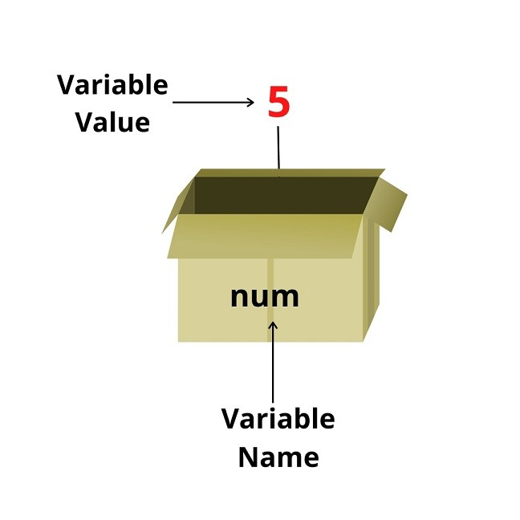

# Variable - JS data types

## Variable (Biến)

- Khi một ứng dụng hoạt động, nó sẽ khởi tạo dữ liệu cần thiết để chương trình hoạt động ổn định và những dữ liệu đó được xử lý tuỳ theo các mục đích khác nhau đã được lập trình sẵn
- JS cũng như các ngôn ngữ khác sẽ dùng biến để lưu trữ những thông tin và dữ liệu đó. Các biến này sẽ được đặt tên sao cho dễ nhớ và dễ nhận biết nó đang lưu trữ dữ liệu gì
- JS cung cấp 4 cách để khai báo một biến:

  - Sử dụng keyword `var`
  - Sử dụng keyword `let`
  - Sử dụng keyword `const`

- Các bước để khai báo ra một biến:
  - Định nghĩa loại biến
  - Đặt tên cho biến
  - Gán giá trị cho nó



> Một biến như một hộp chứa và lưu trữ dữ liệu trong đó

```js
// Khai báo một biến tên là age
let age;

// Lúc này giá trị được lưu vào ô nhớ và liên kết với biến age (gán giá trị cho biến)
age = 30;

// Tại thời điểm này khi sử dụng biến age, thì nó sẽ có giá trị là 30
console.log(age); // 30

// Cách viết ngắn gọn:
let age = 30;

// Khi biến đang chứa giá trị mà ta lại gán cho biến một giá trị khác, thì nó sẽ xoá giá trị cũ và gán lại giá trị mới cho biến
age = 50;
```

## Data types

- JS hiện đang hỗ trợ các kiểu dữ liệu:

  - Symbol (Ít dùng)

    ```js
    const id = Symbol('id');
    ```

  - Object

    ```js
    const developer = {
      domain: 'frontend',
      age: 30,
    };

    const myFriend = {};
    ```

  - Array

    ```js
    const technicals = ['html', 'css', 'javascript'],

    const emptyArray = [];
    ```

  - String

    ```js
    const simpleString = 'Today is a nice  day to learn';

    const emptyString = '';
    ```

  - Number
    ```js
    const age = 30;
    ```
  - BigInt (Ít dùng - Dùng trong mã hoá, crypto với giá trị lớn)
    ```js
    const superBig = 9999999999999999;
    ```
  - Boolean
    ```js
    const isLoggedIn = false;
    const isAlive = true;
    ```
  - Null
    ```js
    const nothing = null;
    ```
  - Undefined

    ```js
    const something; // undefined

    const explicitVar = undefined;

    ```

- JS là ngôn ngữ có kiểu dữ liệu động nên tuỳ vào giá trị khai báo biến ta gán cho nó mà nó sẽ tự xác định kiểu dữ liệu của biến

  ```js
  let counter = 120; // counter is a number
  counter = false; // counter is now a boolean
  counter = 'foo'; // counter is now a string
  ```

## typeof

- Keyword này sẽ giúp ta xác định được kiểu dữ liệu của một biến bằng cách trả về kiểu dữ liệu dưới dạng chuỗi
  ```js
  typeof undefined; // 'undefined'
  typeof 0; // 'number'
  typeof 10n; // 'bigint'
  typeof true; // 'boolean'
  typeof 'hello'; // 'string'
  typeof Symbol('id'); // 'symbol'
  typeof Date; // 'object'
  typeof null; // 'object'
  typeof alert; // 'function'
  ```

## Các loại kiểu dữ liệu

### Kiểu nguyên thuỷ (primitive type)

- Bao gồm boolean, number, string, null, undefined, symbol
- Các biến thuộc loại kiểu dữ liệu này sẽ được đánh giá là đơn giản và sẽ được lưu trữ trực tiếp giá trị trong bộ nhớ.

### Kiểu tham chiếu (reference type)

- Bao gồm: object, function
- Các biến thuộc loại kiểu dữ liệu này sẽ lưu trữ địa chỉ tham chiếu đến ô nhớ lưu giữ giá trị thực sự của nó
- Khi gọi biến thì sẽ trỏ đến địa chỉ ô nhớ mà biến đang lưu -> Lấy giá trị thực sự đang chứa trong địa chỉ đó ra
- Với những phép gán cho object hay array thì JS sẽ copy địa chỉ tham chiếu đó => Khi 2 biến là bản sao kiểu dữ liệu tham chiếu của nhau mà có một biến thay đổi giá trị thì giá trị của biến kia cũng sẽ đổi theo

### Primitive Wrapper Object

- Có 3 kiểu dữ liệu primitive là number, boolean, string sẽ có thêm một wrapper bên ngoài, vd string sẽ có object String, number có object Number, boolean có object Boolean. Mục đích để cung cấp thêm các method sẵn có được gắn trong các object đó gọi là built-in methods hay static method

  ```js
  let language = 'JavaScript';
  let myString = language.substring(4);
  console.log(myString); // Script
  ```

- Một biến có kiểu primitive thì sẽ không có method nào cả. Nhưng ngầm định JS sẽ wrap biến đó lại bằng Primitive Wrapper Object. cụ thể:

  - Từ kiểu primitive sẽ tạo ra một object với kiểu dữ liệu tương ứng với giá trị khởi tạo
  - Gọi và thực thi static method của kiểu dữ liệu này
  - Sau đó xoá instance ngay lập tức

- Đoạn code phía trên sẽ tương đương với:

  ```js
  let language = 'JavaScript';
  let temp = new String(language);
  str = temp.substring(4);
  temp = null;
  ```

- So sánh giữa Primitive Wrapper Object và Reference Data Type:

  - Biến kiểu reference khi tạo ra sẽ được lưu trong bộ nhớ heap cho đến khi được giải phóng
  - Biến sau khi được wrap lại bằng Primitive Wrapper Object sẽ chỉ có tác dụng trong 1 line code. Hết line code thì biến cũng được giải phóng luôn

    ```js
    let s = 'JavaScript';
    s.language = 'ECMAScript'; // wrapped by PWO -> assigned for s.language -> and release immediately
    console.log(s.language); // undefined
    ```
> Ta sẽ không tạo ra biến PWO bằng keyword new với vài lí Do
> - Ảnh hưởng đến hiệu năng: biến PWO bản chất cũng là object và cần thêm bộ nhớ và thời gian để truy cập và xử lý
> - Khó khăn khi xử lý condition statement, vd Number(0) mong muốn là true nhưng nó sẽ thành false
> - Một số JS Engine trên trình duyệt (Như V8 của chrome) sẽ không được tối ưu để xử lý PWO

> => Tổng kết lại: Khi sử dụng biến primitive thì hãy sử dụng đơn giản nhất có thể cùng với các method được cung cấp sẵn tuỳ theo loại dữ liệu nguyên thuỷ muốn dùng