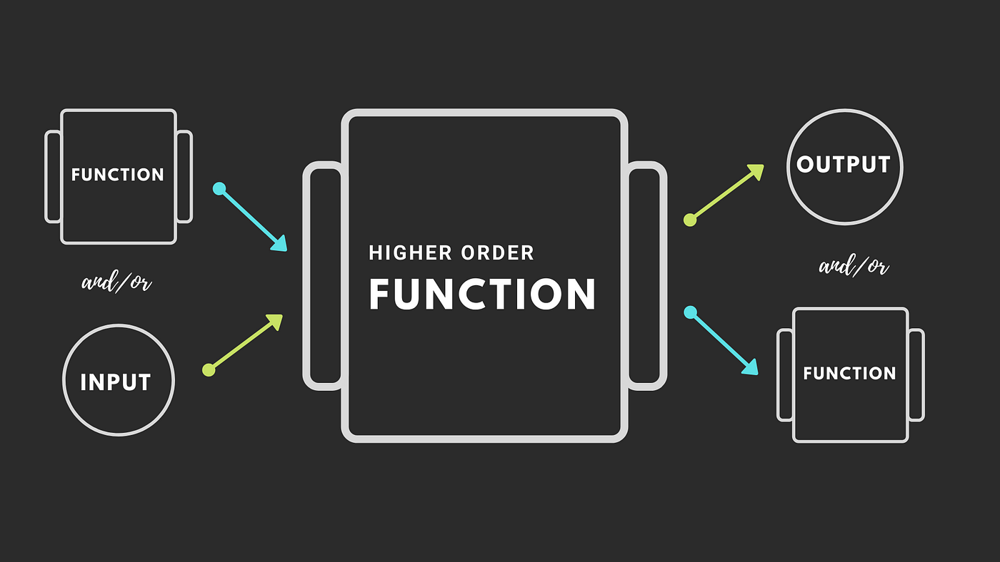

# Function

## Định nghĩa
- Function (hàm) bản chất là một block code được đặt tên - Là một hoặc một chuỗi các statement dùng để thực hiện một tác vụ nào đó hoặc tính toán và trả ra một giá trị

## Gọi một function

## Pass by value & pass by reference

## Function declaration & Function Expression

## Pure function

## HOF (Higher order function)

- 
-
## First class function

## Callback function (Hàm gọi lại)
