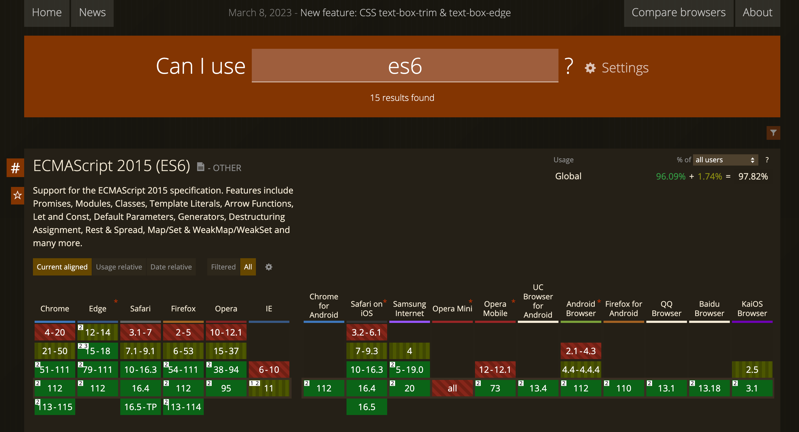

# JavaScript Version

- Ngôn ngữ lập trình JS được phát minh năm 1995 bởi Brendan Eich và trở thành chuẩn ECMA (ECMA standard) năm 1997 bởi tổ chức ECMA - European Computer Manufacturers Association
- `ECMAScript` trở thành tên chính thức của ngôn ngữ, nó là một chuẩn quy định các syntax, semantic và các tính năng của ngôn ngữ. Được duy trì bởi tổ chức tiêu chuẩn ECMA quốc tế - ECMA International Standard Organization. JS chỉ là một triển khai ngôn ngữ của ECMAScript
- Các ngôn ngữ khác tuân theo chuẩn ECMAScript như ActionScript, JScript, TypeScript

- ECMA đã release những phiên bản được viết tắt như ES1, ES2, ES3,...

- Phiên bản mà ta sẽ focus là phiên bản ES6 với một số lí do:

  - Có nhiều cải tiến về syntax như arrow function, template literals, destructuring giúp rút gọn code nhưng vẫn dễ đọc và dễ bảo trì
  - Các cấu trúc dữ liệu mới như Set, Map, Promise, Symbol, Proxy,...
  - Cải thiện performance bằng việc triển khai scope variable (let const thay cho var)
  - Phiên bản nền tảng để có thể tiếp cận và thích nghi nhanh với các bản cập nhật ES trong tương lai

- Chi tiết về lịch sử phát triển của JS có thể tham khảo thêm tại:
  - https://www.geeksforgeeks.org/javascript-versions
  - https://www.w3schools.com/js/js_versions.asp

# Can I use ?

- Phiên bản ngôn ngữ JS luôn được update và các phiên bản trình duyệt hỗ trợ cũng vậy
- Để kiểm tra một tính năng mới của ngôn ngữ có được trình duyệt như chrome, safari,... hỗ trợ hay không ta cần check ở trang web [https://caniuse.com/](https://caniuse.com/)

